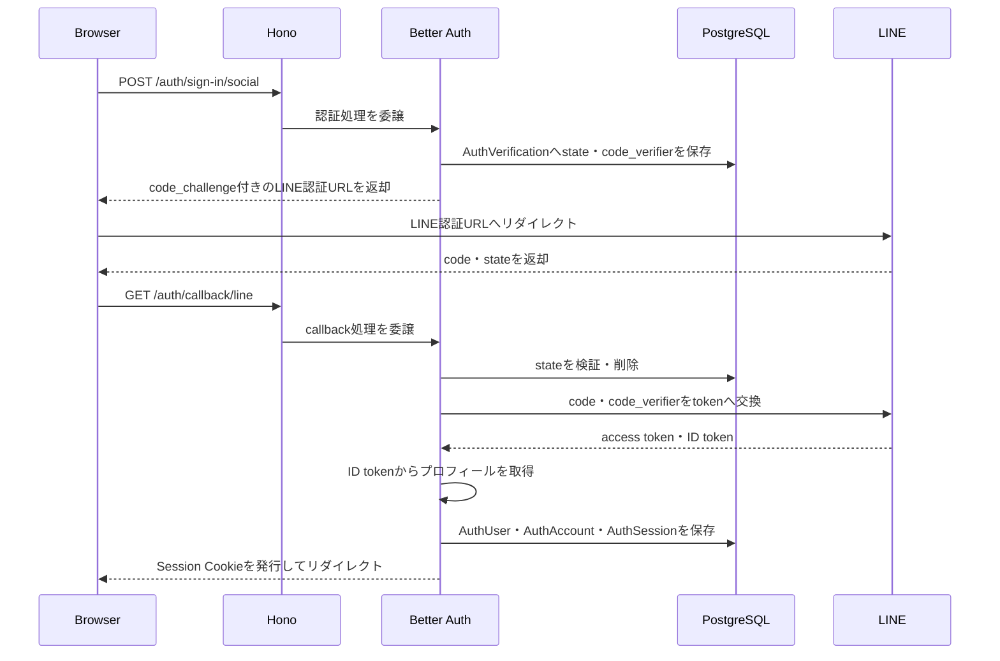
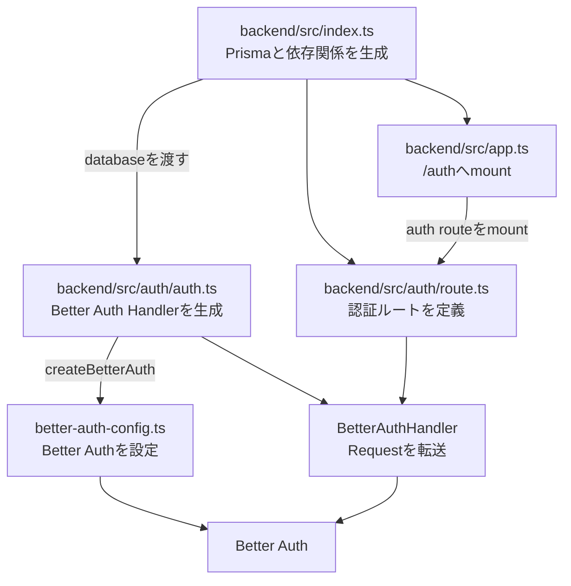

# Better Authの標準LINE ProviderでLINE Loginを実装する

## はじめに

LINE Loginを使ったユーザー認証をBetter Authで実装しました。

実務ではOAuthの認証フローをフルスクラッチで実装した経験があります。今回は、認証ライブラリを利用すると、認証処理をどこまでライブラリへ委譲できるのかを確認するために、Better Authの標準LINE Providerを使ってLINE Loginを実装しました。

結論として、`state`、PKCE、認可コードのtoken交換、LINEプロフィールの取得、ユーザー・アカウント・セッションの保存までをBetter Authへ委譲できました。アプリケーション側では、LINE Providerの設定、データベースの準備、Honoへの接続、メールアドレスを保存しないためのHookを実装しています。

具体的な実装は、[GitHubリポジトリ](https://github.com/HirokaMitsunaga/auth-test)に記載しています。また、実際のLINEアカウントを使ったスマートフォンでの実機テスト手順は、[リポジトリのREADME.md](https://github.com/HirokaMitsunaga/auth-test/blob/main/README.md)にまとめています。

> 本記事はBetter Auth 1.7.2を前提にしています。Better Authのバージョンによって、メールアドレスの扱いやProviderの実装が変わる可能性があります。

## なぜBetter Authなのか

TypeScriptの認証ライブラリとして、Auth.jsも候補に挙がりました。

Auth.jsは、以前のNextAuth.jsにあたるライブラリです。Better Auth公式ブログでは、Auth.jsの保守・運営をBetter Authチームが引き継ぎ、既存ユーザー向けのセキュリティ修正や緊急対応は継続する一方で、特別な機能上の不足がない新規プロジェクトにはBetter Authを推奨すると説明されています。

そのため、今回はBetter Authを採用しました。

[Auth.js is now part of Better Auth](https://better-auth.com/blog/authjs-joins-better-auth)

## 前提

この記事では、次の前提でLINE Loginを実装します。

- LINE Loginの認可コードフローを使用する
- 認可コードインジェクション対策としてPKCEを使用する
- `scope`は`openid profile`に限定し、`email`は要求しない
- LINEからメールアドレスを取得しないため、`AuthUser.email`は`NULL`を許容する
- Better Auth 1.7.2のcallbackが要求するメールアドレスには一時的なplaceholderを渡し、ユーザー作成前に`NULL`へ戻す

LINE Loginでは、`email` scopeを指定した場合にメールアドレスを取得できます。今回は`email` scopeを指定しないため、メールアドレスは取得しません。[LINE Login公式ドキュメント](https://developers.line.biz/en/docs/line-login/integrate-line-login/)

### 実行環境

| 技術          | バージョン |
| ------------- | ---------- |
| Hono          | 4.12.31    |
| Better Auth   | 1.7.2      |
| Prisma Client | 7.8.0      |
| Prisma CLI    | 7.8.0      |
| PostgreSQL    | 18.4       |

## セキュリティ方針

OAuth/OIDCフローにおける`state`、PKCE、認可コード交換、セッション発行などの共通処理はBetter Authへ委譲します。

一方で、Cookieの属性、アカウント連携、Provider tokenの保存有無、メールアドレスを保存しない方針は、アプリケーション側の設定として明示します。

| 対策             | 防ぐ脅威                               | この構成での実施内容                                                                |
| ---------------- | -------------------------------------- | ----------------------------------------------------------------------------------- |
| `state`          | ログインCSRF、認可レスポンスの取り違え | ログイン開始時に生成・保存し、callback時に検証する                                  |
| PKCE             | 認可コードの横取り・インジェクション   | `code_verifier`から`code_challenge`を生成し、token交換時に`code_verifier`を検証する |
| `HttpOnly`       | JavaScriptからのCookie読み取り         | セッションCookieに設定する                                                          |
| `Secure`         | HTTP通信時のCookie送信                 | HTTPS通信でのみCookieを送信する                                                     |
| `SameSite=Lax`   | クロスサイトリクエストによるCookie送信 | セッションCookieに設定する                                                          |
| `__Host-` Cookie | CookieのDomain指定による意図しない共有 | `Domain`を指定せず、`Path=/`と`Secure`を設定する                                    |

今回は`state`とPKCEを使用し、OIDCの`nonce`は明示的には使用しません。

LINE Loginでは`nonce`は任意のパラメータです。Better Auth 1.7.2の標準LINE Providerは認可URLへ`nonce`を転送しないため、`nonce`によってID tokenと認証リクエストを紐付ける場合は、Providerの拡張または独自実装が必要です。

[Better Auth 1.7.2の標準LINE Provider実装](https://github.com/better-auth/better-auth/blob/v1.7.2/packages/core/src/social-providers/line.ts#L51-L74)

## Better Authに委譲している処理

Better Authは、次の処理を担当します。

- `state`と`code_verifier`の生成
- OAuth stateの保存・検証・削除
- `code_challenge`付きのLINE認証URLの生成
- 認可コードのtoken交換
- LINEのID tokenまたはUserInfoからのプロフィール取得
- LINEプロフィールからBetter Authのユーザー情報への変換
- `AuthUser`、`AuthAccount`、`AuthSession`の作成または取得
- セッションCookieの発行
- callback URLへのリダイレクト

この構成ではPrisma adapterによるデータベースを設定しているため、Better Auth 1.7.2のデフォルト設定によりOAuth stateはデータベースへ保存されます。

## 全体の処理の流れ

処理の順序は次のとおりです。



今回のscopeには`openid`を含めているため、LINEのtoken responseにはID tokenが含まれます。Better Authの標準LINE Providerは、ID tokenが取得できた場合はそこからプロフィールを取得し、取得できない場合にUserInfo endpointを利用します。

## Better Authの設定

実際の設定は[`better-auth-config.ts`](https://github.com/HirokaMitsunaga/auth-test/blob/main/backend/src/auth/infra/better-auth/better-auth-config.ts)に集約しています。

このファイルでは、Better Authの生成、Prisma adapter、モデル名、セッション、Cookie、アカウント連携、標準LINE Providerの設定値を組み立てています。

Better Authの各オプションの詳細は、[Better Auth公式のOptionsドキュメント](https://better-auth.com/docs/reference/options)を参照してください。

### 標準LINE Providerに設定を追加する

Better Auth 1.7.2のLINE Providerには、`openid`、`profile`、`email`がデフォルトscopeとして設定されています。

今回はメールアドレスを取得しないため、`disableDefaultScope`を`true`にしてデフォルトscopeを無効にし、`openid profile`だけを明示的に指定します。

```ts
socialProviders: {
  line: {
    clientId: LINE_CLIENT_ID,
    clientSecret: LINE_CLIENT_SECRET,
    redirectURI: LINE_REDIRECT_URI,
    disableDefaultScope: true,
    scope: ['openid', 'profile'],
    mapProfileToUser: (profile) => ({
      email: `line-${profile.sub}@example.invalid`,
    }),
    disableIdTokenSignIn: true,
  },
},
```

`mapProfileToUser`では、Better Authのcallback処理を通過するためのplaceholder emailを設定しています。`example.invalid`は実在しないメールアドレス用の予約ドメインです。

このplaceholderは認証情報や連絡先として利用しません。ユーザー作成前のHookで`NULL`に戻すため、データベースに保存されるメールアドレスは`NULL`です。

### placeholder emailを保存前にNULLへ戻す

`mapProfileToUser`で設定したplaceholderを、`databaseHooks.user.create.before`で`NULL`へ戻します。

```ts
databaseHooks: {
  user: {
    create: {
      before: clearLinePlaceholderEmail,
    },
  },
},
```

Hookの実装例です。

```ts
const LINE_PLACEHOLDER_EMAIL_PATTERN = /^line-.+@example\.invalid$/;

export const clearLinePlaceholderEmail = (user: { email?: string }) => {
  if (!user.email || !LINE_PLACEHOLDER_EMAIL_PATTERN.test(user.email)) {
    return Promise.resolve();
  }

  return Promise.resolve({
    data: { email: null } as unknown as { email?: string },
  });
};
```

また、Prisma schemaでは`AuthUser.email`をnullableにします。以下は`email`カラム周辺を抜粋した例です。

```prisma
model AuthUser {
  id            String   @id
  name          String
  email         String?  @unique
  emailVerified Boolean  @default(false)
  image         String?
  createdAt     DateTime @default(now())
  updatedAt     DateTime @updatedAt
}
```

### DB

Prisma adapterを使用し、Better Authのモデル名を次のように固定しています。

| 設定           | テーブル           | 役割                                       |
| -------------- | ------------------ | ------------------------------------------ |
| `user`         | `AuthUser`         | Better Authで管理するユーザー              |
| `session`      | `AuthSession`      | ログイン状態とセッションの有効期限         |
| `account`      | `AuthAccount`      | LINEなどの外部アカウントとユーザーの紐付け |
| `verification` | `AuthVerification` | OAuth stateなど、一時的な検証データ        |

既存の業務テーブルや業務ロジックとは分離し、Better AuthとPrisma adapterに認証テーブルの管理を委譲してます。

詳しいスキーマは、[Better Auth公式のDatabaseドキュメント](https://better-auth.com/docs/concepts/database#core-schema)を参照してください。

### セッション・Cookie・アカウント連携

今回の設定方針は次のとおりです。

- アプリケーションセッションの有効期限を7日にする
- セッションが利用されたとき、1日以上経過していれば有効期限を延長する
- Cookieに`httpOnly`、`secure`、`sameSite: 'lax'`を設定する
- `__Host-` Cookieを利用するため、`Domain`を指定しない
- ログイン後にLINE APIを呼び出さないため、Provider tokenを保存しない
- OAuthログイン時の暗黙的なアカウントリンクを無効にする

```ts
const AUTH_SESSION_EXPIRES_IN_SECONDS = 60 * 60 * 24 * 7;
const AUTH_SESSION_UPDATE_AGE_IN_SECONDS = 60 * 60 * 24;

const AUTH_COOKIE_ATTRIBUTES = {
  httpOnly: true,
  secure: true,
  sameSite: 'lax' as const,
  path: '/',
};

betterAuth({
  database: prismaAdapter(database, {
    provider: 'postgresql',
    transaction: true,
  }),

  user: {
    modelName: 'AuthUser',
  },

  session: {
    modelName: 'AuthSession',
    expiresIn: AUTH_SESSION_EXPIRES_IN_SECONDS,
    updateAge: AUTH_SESSION_UPDATE_AGE_IN_SECONDS,
  },

  account: {
    modelName: 'AuthAccount',
    updateAccountOnSignIn: false,
    storeAccountCookie: false,
    accountLinking: {
      enabled: true,
      disableImplicitLinking: true,
    },
  },

  verification: {
    modelName: 'AuthVerification',
  },

  advanced: {
    // Cookie名にすでに__Host-を付けるため、__Secure-を重ねて付けない。
    // Secure属性はAUTH_COOKIE_ATTRIBUTESで明示的に設定する。
    useSecureCookies: false,
    cookiePrefix: '__Host-auth',
    defaultCookieAttributes: AUTH_COOKIE_ATTRIBUTES,
    cookies: {
      session_token: {
        name: '__Host-session',
        attributes: {
          ...AUTH_COOKIE_ATTRIBUTES,
          maxAge: AUTH_SESSION_EXPIRES_IN_SECONDS,
        },
      },
    },
  },

  databaseHooks: {
    user: {
      create: {
        before: clearLinePlaceholderEmail,
      },
    },
    account: {
      create: {
        before: clearAccountTokenFields,
      },
      update: {
        before: clearAccountTokenFields,
      },
    },
  },
});
```

`updateAccountOnSignIn: false`によって、再ログイン時にProviderから取得したtoken情報で`AuthAccount`を更新しないようにしています。

`storeAccountCookie: false`によって、OAuthフロー後にProvider tokenをCookieへ保存しないようにしています。さらに、`databaseHooks.account.create.before`と`databaseHooks.account.update.before`で、データベースへ保存されるtoken関連カラムを`NULL`にしています。

```ts
const ACCOUNT_TOKEN_FIELDS = {
  accessToken: null,
  refreshToken: null,
  idToken: null,
  accessTokenExpiresAt: null,
  refreshTokenExpiresAt: null,
  scope: null,
} as const;

export const clearAccountTokenFields = () =>
  Promise.resolve({ data: ACCOUNT_TOKEN_FIELDS });
```

ログイン後にLINE APIを利用する必要がある場合は、この設定をそのまま利用できません。Provider tokenを保存し、必要に応じて暗号化やrefresh tokenの管理を検討する必要があります。

## アプリケーション側の実装

アプリケーション側では、Better Authの生成とHonoへの接続を実装します。

### 依存関係の組み立て

依存関係は`auth/auth.ts`で組み立てています。

```ts
export const createAuth = (database: AuthDatabase): IAuthRequestHandler => {
  const auth = createBetterAuth(database);
  return new BetterAuthHandler(auth);
};
```

`createBetterAuth`でBetter Authを生成し、それを`BetterAuthHandler`へ渡します。`BetterAuthHandler`は受け取ったHTTP RequestをBetter Authのhandlerへ転送するアダプターです。

依存関係は次のようになります。



### Honoの認証ルート

Hono側では、Better Authのhandlerを使って認証関連のリクエストを転送します。

```ts
export const createAuthRoute = (auth: IAuthRequestHandler) => {
  const authRoute = new Hono();

  authRoute.post('/sign-in/social', (c) => auth.handle(c.req.raw));

  authRoute.on(['GET', 'POST'], '/callback/line', (c) =>
    auth.handle(c.req.raw),
  );

  return authRoute;
};
```

このアプリケーションでは、次の2つのルートを登録しています。

- `POST /auth/sign-in/social`
- `GET|POST /auth/callback/line`

`/auth/sign-in/social`はBetter AuthへLINEログインの開始を依頼するエンドポイントです。Better Authが生成した認証URLをブラウザへ返し、ブラウザがLINEへリダイレクトします。

LINEでの認証後は、`/auth/callback/line`へリダイレクトされます。callbackでは`code`と`state`をBetter Authへ渡し、認可コードの検証、token交換、ユーザー作成、セッション発行を委譲します。

`LINE_REDIRECT_URI`には、LINE Developers Consoleに登録した次のURLを設定します。

```text
https://{公開ホスト}/auth/callback/line
```

## 今回の構成で扱っていないこと

### nonceによるID tokenと認証リクエストの紐付け

前述のとおり、Better Auth 1.7.2の標準LINE Providerでは、今回の認可URLに`nonce`を付与していません。

`nonce`も利用する場合は、標準Providerを拡張して認可URLへnonceを転送し、callbackでID token内のnonceと照合する実装が必要です。

### メールアドレスを利用したログイン・アカウント連携

今回は`email` scopeを要求していないため、メールアドレスを使ったアカウント連携は行いません。

メールアドレスが必要な場合は、LINE Developers Consoleでメールアドレス取得権限を申請したうえで、`email` scopeを追加します。

### ログイン後のLINE API呼び出し

Provider tokenを保存していないため、ログイン後にLINE APIを呼び出す用途には対応していません。

友だち関係の確認など、ログイン後にもLINE APIを利用する場合は、Provider tokenの保存方針を変更する必要があります。

## まとめ

Better Authを使うことで、次の処理を自分で実装せずに済みました。

- `state`の生成・保存・検証
- PKCEの`code_verifier`と`code_challenge`の生成
- 認可コードのtoken交換
- LINE Providerのプロフィール取得
- `AuthUser`、`AuthAccount`、`AuthSession`の作成
- セッションCookieの発行

一方で、アプリケーション側には次の実装が必要でした。

- LINEのscope設定
- `AuthUser.email`をnullableにするデータベース設計
- Better Auth 1.7.2のcallbackを通過するためのplaceholder email
- placeholderを`NULL`へ戻すHook
- Provider tokenを保存しないためのHook
- Better AuthとHonoを接続するhandlerとルート

今回の実装を通して、OAuth/OIDCのセキュリティロジックをフルスクラッチで実装する場合と比べて、Better Authを使うことでアプリケーション側の責務をかなり小さくできることが分かりました。

ただし、ライブラリに委譲できる処理と、アプリケーション側で意思決定すべき処理は分けて考える必要があることがわかりました。特に、scope、nonce、アカウント連携、Provider tokenの保存方針は、アプリケーションの要件に合わせて設定する必要があるなと思いました。
