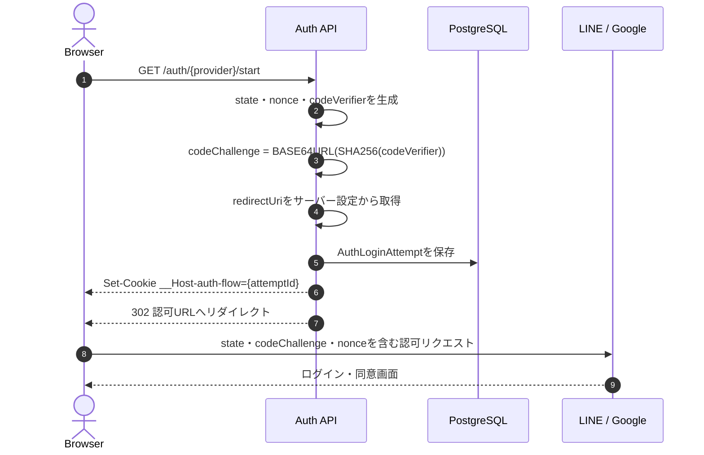
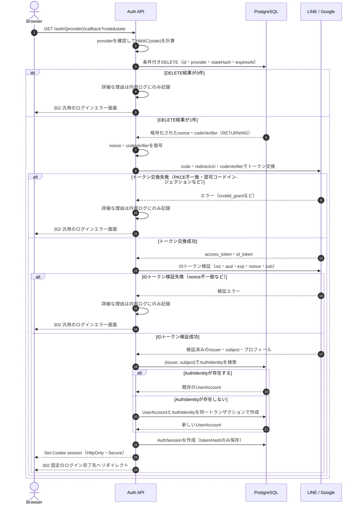

# Auth

LINE Login などの外部認証プロバイダーを利用した認証処理を管理する。

このディレクトリでは、プロバイダー固有のOAuth/OIDC通信と、アプリケーション側のユーザー・セッション管理を分離する。

## 前提

- ブラウザからバックエンドへリダイレクトするWebログインを想定する
- Cognitoなどの認証基盤は利用せず、ログイン後のアプリケーションセッションは自前で発行する
- LINE以外にGoogleなどのプロバイダーを追加できる構成にする
- LINEやGoogleのアクセストークン、IDトークンは、ログイン処理に必要な時間だけ扱い、原則として永続化しない

## 設計方針

`LINE` は認証全体の名前ではなく、外部プロバイダーとの接続部分でのみ使用する。

```text
auth/
├── controller/http/
│   ├── auth.route.ts
│   ├── line-login.route.ts
│   └── google-login.route.ts
├── usecase/
│   ├── start-login.use-case.ts
│   ├── complete-login.use-case.ts
│   └── revoke-session.use-case.ts
├── port/
│   ├── external-auth-provider.interface.ts
│   ├── auth-identity-repository.interface.ts
│   ├── auth-login-attempt-repository.interface.ts
│   ├── auth-session-repository.interface.ts
│   └── user-account-provisioner.interface.ts
├── infra/
│   ├── provider/
│   │   ├── line-auth-provider.ts
│   │   └── google-auth-provider.ts
│   ├── repository/
│   │   ├── user-account.repository.prisma.ts
│   │   ├── auth-identity.repository.prisma.ts
│   │   ├── auth-login-attempt.repository.prisma.ts
│   │   └── auth-session.repository.prisma.ts
│   └── crypto/
│       └── secret-box.ts
├── integration-test/
└── README.md
```

依存方向は次のようにする。

```text
controller → usecase → port ← infra
```

`usecase` はLINE SDK、Google SDK、Prismaなどを直接参照しない。`port` は外部との境界となるインターフェースであり、`infra` が実装する。

## ログインフロー

### 1. ログイン開始

`GET /auth/:provider/start` で次の値を生成する。

- `state`: CSRF対策とログイン試行の紐付けに使用するランダム値
- `nonce`: IDトークンのリプレイ・取り違え対策に使用するランダム値
- `code_verifier`: PKCEで使用する秘密値
- `code_challenge`: `code_verifier` から `S256` で生成する値

`state`、`nonce`、`code_verifier` は同じログイン試行に属する値として保存する。認可URLには、少なくとも次を含める。

```text
response_type=code
client_id=...
redirect_uri=登録済みの固定URL
state=...
code_challenge=...
code_challenge_method=S256
scope=profile openid
nonce=...
```

ログイン試行の `id` は暗号学的乱数で生成し、`__Host-auth-flow` Cookieに保存する。このCookieを使って、コールバックを開始したブラウザのログイン試行を特定する。連番IDや推測可能な値は使用しない。

`redirect_uri` はプロバイダーごとのサーバー設定から決定する。クライアントから受け取った値は使用せず、ログイン開始時とトークン交換時に同じ設定値を使う。値をログイン試行テーブルへ保存する必要はない。

ログイン試行の有効期限は短く設定する。初期値は5〜10分程度とし、期限切れの試行は完了できないようにする。



### 2. コールバック

`GET /auth/:provider/callback` では、次の順序で処理する。

1. `provider` と認可エンドポイントをサーバー側の設定と照合する
2. `__Host-auth-flow` Cookieからログイン試行を取得する
3. `state`、プロバイダー、有効期限を検証する
4. 条件付きDELETEでログイン試行を原子的に消費し、nonceとcodeVerifierを取得する
5. サーバー設定から再計算した同じ `redirect_uri` と、取得した `code_verifier` でトークン交換する
6. IDトークンの署名とクレームを検証する
7. 検証済みの `issuer` と `subject` で `AuthIdentity` を検索する
8. 未登録ならユーザーと `AuthIdentity` を同一トランザクションで作成する
9. アプリケーション独自のセッションを発行する
10. サーバー設定で決めたログイン完了先へリダイレクトする

認可コード、IDトークン、アクセストークンをログに出力しない。コールバックをリロードされても、同じログイン試行を2回完了できないようにする。



認可コード交換やIDトークン検証に失敗しても、ユーザーには詳細な理由を返さず、汎用のログインエラー画面へ遷移させる。詳細な失敗理由はサーバー側のログやメトリクスで確認する。ログイン試行はトークン交換前に削除済みのため、失敗後は同じ試行を再利用せず、新しいログインを開始する。

## テーブル設計

### AuthLoginAttempt

OAuth/OIDCのログイン試行を一時的に保存するテーブル。CSRF対策とPKCEのための状態を、認証処理の完了まで保持する。

```text
AuthLoginAttempt
----------------
id              String    PK
provider        String    LINE / GOOGLEなど
stateHash       String    HMAC化したstate。検索用インデックスは付けない
nonce           String    DBではAEAD暗号文として保存
codeVerifier    String    DBではAEAD暗号文として保存
expiresAt       DateTime
createdAt       DateTime
```

設計上の注意点:

- `id` は暗号学的乱数で生成し、`__Host-auth-flow` Cookieの値として使用する。CookieにはHttpOnly・Secure・SameSite属性を付ける
- `state` は平文で保存せず、サーバー秘密鍵を使ったHMACなどのハッシュを保存する
- `code_verifier` はコールバック時に復元する必要があるため、ハッシュではなくAEADで暗号化して保存する
- `nonce` はプロバイダーのIDトークン検証に必要になるため、平文ではなく暗号化保存する
- 暗号鍵はDBに保存せず、環境変数または秘密情報管理サービスから取得する
- コールバック時は`attemptId`を主キーに検索するため、`stateHash`にはユニーク制約や検索用インデックスを付けない
- `id`、`provider`、`stateHash`、`expiresAt > 現在時刻` を条件に、`DELETE ... RETURNING` を実行する
- DELETEの結果が1件の場合だけ、取得した`nonce`と`codeVerifier`で後続処理を行う。0件の場合は認証を拒否する
- DELETEは条件確認と同時に行うため、同じログイン試行の並行コールバックを1回だけ通過させられる
- `expiresAt` はコールバック時の有効期限判定と、コールバックされなかったレコードの定期削除に使う
- 初期設計では`expiresAt`にインデックスを付けない。レコード数が増え、期限切れレコードの削除が負荷になった時点で追加する
- `redirectUri` は固定のプロバイダー設定から導出できるため、このテーブルには保存しない
- ログイン後の遷移先を指定する要件がないため、`returnTo` は持たせない。将来追加する場合は、許可済みの相対パスだけを保存する

ログイン試行をコールバックの最後に削除するのではなく、トークン交換より前に原子的に削除する。トークン交換やIDトークン検証に失敗した場合は、同じログイン試行を再利用せず、新しいログイン試行を開始する。これにより、`status` や `consumedAt` を持たずに一度きりの処理を保証できる。

概念的なSQLは次のとおり。

```sql
DELETE FROM AuthLoginAttempt
WHERE id = :attemptId
  AND provider = :provider
  AND stateHash = :stateHash
  AND expiresAt > CURRENT_TIMESTAMP
RETURNING nonce, codeVerifier;
```

DBではなく、共有セッションストアに一時情報を保存する実装も可能だが、現在の構成ではPostgreSQL上のこのテーブルを第一候補とする。

### UserAccount

アプリケーション内でユーザーを表すアカウントテーブル。認証を起点に新しく作成する。

```text
UserAccount
-----------
id           String    PK
displayName  String    NULL可。プロフィール未設定を許容する
email        String    NULL可。ログイン識別子には使わない
createdAt    DateTime
updatedAt    DateTime
```

パスワードログインを提供しない前提では、`password` カラムは持たせない。メールアドレスはプロフィール情報として保持する場合だけ追加し、外部IDの代わりには使わない。

関連は次のようにする。

```text
UserAccount 1 ─── * AuthIdentity
UserAccount 1 ─── * AuthSession
UserAccount 1 ─── * Todo（Todoを残す場合）
```

### AuthIdentity

外部認証プロバイダーのユーザーと、アプリケーションの `UserAccount` を紐付けるテーブル。

```text
AuthIdentity
------------
id          String    PK
userId      String    FK -> UserAccount.id
provider    String    LINE / GOOGLEなど
issuer      String    OIDCのiss
subject     String    OIDCのsub
createdAt   DateTime
updatedAt   DateTime
```

制約:

```text
UNIQUE (issuer, subject)
UNIQUE (userId, provider)
```

ログイン時のユーザー識別には、メールアドレスや表示名ではなく `(issuer, subject)` を使用する。LINEのユーザーIDやGoogleの `sub` を、`line_user_id` のように `UserAccount` へ直接追加しない。

メールアドレスはプロバイダーによって取得できない場合や変更される場合があるため、メールアドレスだけで既存ユーザーへ自動紐付けしない。既存アカウントとの統合を行う場合は、ログイン済みユーザーによる明示的なアカウント連携フローを用意する。

初回ログイン時は、`UserAccount` と `AuthIdentity` を同一DBトランザクションで作成する。既に同じ `(issuer, subject)` が存在する場合は、重複登録せず既存の `UserAccount` にログインさせる。

### AuthSession

ログイン完了後にアプリケーションが発行するセッションを管理するテーブル。

```text
AuthSession
-----------
id          String    PK
userId      String    FK -> UserAccount.id
tokenHash   String    UNIQUE
expiresAt   DateTime
revokedAt   DateTime  NULL可
lastUsedAt  DateTime  NULL可
createdAt   DateTime
```

ブラウザには推測困難なランダムセッショントークンをHttpOnly・Secure Cookieで渡し、DBにはトークンそのものではなくハッシュだけを保存する。

```text
ブラウザCookieのセッショントークン
              ↓ ハッシュ化
AuthSession.tokenHash
```

LINEのアクセストークンやIDトークンをアプリケーションのセッションとして利用しない。LINE APIをログイン後にも呼び出す必要がある場合だけ、プロバイダー用トークンを別テーブルに暗号化保存する。

## 3つの値の役割

| 値              | 主な脅威                           | 保存方法     | 検証方法                           |
| --------------- | ---------------------------------- | ------------ | ---------------------------------- |
| `state`         | コールバックへのCSRF               | HMACハッシュ | コールバックの値をHMACして一致比較 |
| `code_verifier` | 認可コードインジェクション・横取り | AEAD暗号化   | トークン交換時に元の値を送信       |
| `nonce`         | IDトークンのリプレイ・取り違え     | AEAD暗号化   | IDトークンの `nonce` と一致比較    |

3つともログイン試行ごとに新しく生成し、使い回さない。いずれもURLやログへ不用意に出力しない。

## IDトークン検証

JWTをデコードしただけでユーザー情報を信頼しない。プロバイダーごとのアダプターで、少なくとも次を検証する。

- 署名が正しいこと
- `iss` が想定したIssuerであること
- `aud` が自アプリのClient IDであること
- `exp` が期限内であること
- 必要に応じて `iat`、`auth_time` を確認すること
- `nonce` がログイン試行の値と一致すること
- `sub` が存在すること

LINE Loginでは、LINEが提供するIDトークン検証エンドポイントを利用するか、公式仕様に従って署名鍵とクレームを検証する。クライアントから送られた表示名・メールアドレスをそのままユーザー登録情報として信頼せず、LINEのトークン検証結果またはLINE APIから取得した情報を使う。

## `domain` ディレクトリについて

`domain` は必須ではない。OAuthの認可コード交換、HTTP通信、暗号化、Cookie処理は認証の技術的な実装であり、`infra` または `controller` の責務である。

一方、次のようなアプリケーション固有のルールが増えた場合は、`auth/domain` を追加する。

- 1つの外部IDは必ず1つのユーザーにだけ紐付く
- 1ユーザーに同じプロバイダーを2つ紐付けられない
- 外部アカウントの連携・解除に条件がある
- アカウント統合や退会時の認証情報削除にルールがある

その場合の候補は次のとおり。

```text
auth/domain/
└── auth-identity/
    ├── auth-identity.entity.ts
    └── auth-identity-policy.ts
```

現時点では、`AuthIdentity` の一意性をDB制約とユースケースで担保し、ドメイン層は必要になった時点で追加する方針とする。

## 実装時のチェックリスト

- [ ] ログイン試行ごとに `state`、`nonce`、`code_verifier` を生成する
- [ ] PKCEは `S256` を使用し、`code_verifier` をブラウザからコールバックパラメーターで受け取らない
- [ ] `state` をトークン交換より前に検証する
- [ ] `redirect_uri` を認可開始時とトークン交換時で完全一致させる
- [ ] ログイン試行を一度だけ消費できるようにする
- [ ] IDトークンの署名・`iss`・`aud`・`exp`・`nonce`・`sub` を検証する
- [ ] ユーザー識別に `(issuer, subject)` を使用する
- [ ] 外部トークン、認可コード、`state`、`nonce`、`code_verifier` をログに出力しない
- [ ] セッションCookieに `HttpOnly`、`Secure`、適切な `SameSite` を付ける
- [ ] 期限切れの `AuthLoginAttempt` を削除する
- [ ] 認証失敗時に、外部から入力された詳細なエラーをそのまま画面へ返さない

## 参考資料

- [LINE Login v2.1 API reference](https://developers.line.biz/en/reference/line-login/)
- [Integrating LINE Login with your web app](https://developers.line.biz/en/docs/line-login/integrate-line-login/)
- [LINE Login security checklist](https://developers.line.biz/en/docs/line-login/security-checklist/)
- [RFC 7636: Proof Key for Code Exchange by OAuth Public Clients](https://www.rfc-editor.org/rfc/rfc7636)
- [OpenID Connect Core 1.0](https://openid.net/specs/openid-connect-core-1_0-final.html)
