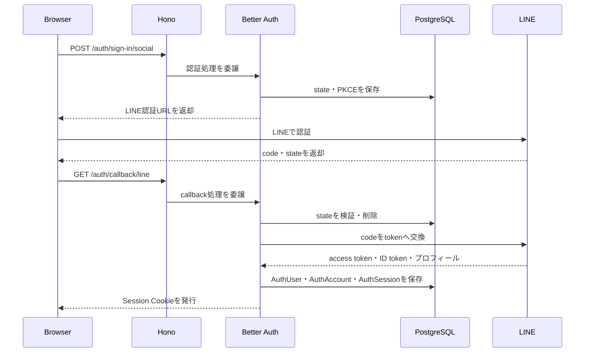

## はじめに

LINE Loginを使ったユーザー認証をBetter Authで実装してみました。
実務でOAuthを使った認証をフルスクラッチで実装した経験があるため、
ライブラリを使うとどの程度実装を簡略化できるのかを確かめるために、本記事を書きました。

本記事では、Better Authの標準LINE Providerを使い、LINE Loginに必要な設定だけを追加する構成を紹介します。
具体的な実装は、[GitHubリポジトリ](https://github.com/HirokaMitsunaga/auth-test)に記載しています。また、実際のLINEアカウントを使ったスマホでの実機テスト手順は、[リポジトリのREADME.md](https://github.com/HirokaMitsunaga/auth-test/blob/main/README.md)にまとめています。

## なぜBetter Authなのか

TypeScriptの認証ライブラリとして、Auth.jsも候補に挙がりました。
Auth.jsは以前のNextAuth.jsにあたり、ChatGPTやGoogle Labsなどでも利用されているライブラリです。

Better Auth公式ブログでは、Auth.jsの保守・運営をBetter Authチームが引き継ぎ、
既存ユーザー向けのセキュリティ修正や緊急対応は継続する一方で、
特別な機能上の不足がない新規プロジェクトにはBetter Authを推奨すると説明されています。
そのため、今回はBetter Authを採用しました。

[Auth.js is now part of Better Auth](https://better-auth.com/blog/authjs-joins-better-auth)

## 全体の処理の流れ

この図では処理の順序を示しています。



## Better Authの責務分担

今回の構成では、OAuthの基盤処理とLINE Providerの処理をBetter Authへ委譲し、設定でscopeだけを変更します。

| 処理                                             | 担当        |
| ------------------------------------------------ | ----------- |
| `state`の生成・検証（CSRF対策）                    | Better Auth |
| PKCEの生成・検証（認可コードインジェクション対策） | Better Auth |
| LINEの認可URL生成・認可コード交換                  | Better Authの標準LINE Provider |
| LINEプロフィールの取得・Better Auth形式への変換    | Better Authの標準LINE Provider |
| `AuthUser`、`AuthAccount`、`AuthSession`の作成      | Better Auth |

> Better Authを使うことで、OAuthの基盤処理だけでなくLINE Providerの処理も委譲できます。今回の独自設定は、LINEが要求するscopeを`openid profile`に限定することと、メールアドレスを取得しない場合のplaceholder email変換だけです。

```text
LINEログイン
  ├─ OAuth/OIDCの共通処理
  │    └─ Better Auth
  └─ LINE Providerの設定
       └─ backend/src/auth/infra/better-auth/better-auth-config.ts
```

## 標準LINE Providerへ設定を追加する

Better Authの標準LINE Providerを直接設定します。`disableDefaultScope`で標準scopeを無効化し、ログインに必要な`openid profile`だけを指定します。

認可コードインジェクションにはPKCE、OAuthコールバックへのCSRF攻撃にはstateで対応します。
今回のAuthorization Code Flowでは、OIDC上必須ではないnonceは扱いません。

> 注意: nonceを実装する場合、Better Auth 1.7.2の標準LINE Providerは認可URLへnonceを転送しないため、`createAuthorizationURL`の独自実装などが必要になりそうです。[標準LINE Providerの実装](https://github.com/better-auth/better-auth/blob/v1.7.2/packages/core/src/social-providers/line.ts#L51-L74)

```ts
socialProviders: {
  line: {
    clientId: LINE_CLIENT_ID,
    clientSecret: LINE_CLIENT_SECRET,
    redirectURI: LINE_REDIRECT_URI,
    disableDefaultScope: true,
    scope: ['openid', 'profile'],
    disableIdTokenSignIn: true,
  },
},
```

### メールアドレスを取得しない場合

今回のscopeには`email`を含めていないため、LINEからメールアドレスは取得しません。
Better Auth 1.7.2のcallbackはメールアドレスを必須としているため、実装では`mapProfileToUser`で一時的なplaceholder emailを渡し、ユーザー作成前のhookで`NULL`へ戻します。

```ts
socialProviders: {
  line: {
    // ...
    mapProfileToUser: (profile) => ({
      email: `line-${profile.sub}@example.invalid`,
    }),
  },
},
```

placeholderは認証情報として利用せず、実際に保存されるメールアドレスは`NULL`です。

## Better Authの設定

実際の設定は[`better-auth-config.ts`](https://github.com/HirokaMitsunaga/auth-test/blob/main/backend/src/auth/infra/better-auth/better-auth-config.ts)に集約しています。
このファイルでは、Better Authの生成、Prisma adapter、セッション、Cookie、標準LINE Providerの設定値を組み立てます。

設定ファイルのコード自体は見れば確認できるため、ここでは採用した設定の意図だけを記載します。
Better Authの各オプションの詳細は、[Better Auth公式のOptionsドキュメント](https://better-auth.com/docs/reference/options)を参照してください。

### DB

Prisma adapterを使用し、Better Authのモデル名は次のように固定しています。

`AuthUser`、`AuthAccount`、`AuthSession`、`AuthVerification`をBetter Auth専用のテーブルとして使用します。
既存の業務テーブルや業務ロジックとは分離し、Better AuthとPrisma adapterに管理を委譲します。

### セッション・Cookie・アカウント連携

- セッションの有効期限はBetter Authの設定で固定する
- Cookieは`httpOnly`、`secure`、`sameSite: 'lax'`を設定する
- `__Host-` Cookieを利用するため、`Domain`は指定しない
- メールアドレス一致による暗黙のアカウントリンクは無効にする
- ログイン後に利用しないProvider tokenは`AuthAccount`へ保存しない

### Providerの設定値

```ts
socialProviders: {
  line: {
    clientId: LINE_CLIENT_ID,
    clientSecret: LINE_CLIENT_SECRET,
    redirectURI: LINE_REDIRECT_URI,
    disableDefaultScope: true,
    scope: ['openid', 'profile'],
    mapProfileToUser: (profile) => ({
      email: `line-${profile.sub}@example.invalid`,
    }),
    disableIdTokenSignIn: true,
  },
},
```

`clientId`、`clientSecret`、`redirectURI`はサーバー側の環境変数から注入し、リクエストから上書きできないようにします。
`redirectURI`はLINE Developers Consoleの設定と完全一致させます。scopeは`openid profile`に固定し、`email`は要求しません。

## まとめ

Better Authを使うことで、OAuth/OIDC認証で必要になるstate、PKCE、認可コード交換、LINE Providerの処理、セッション発行などを自分で実装せずに済みました。

今回、アプリケーション側で必要になったのは、LINEのscope設定と、Better Auth 1.7.2のcallbackが要求するemailを一時的に補う設定だけです。

今後Googleなどを追加する場合も、標準Providerで対応できるものは標準機能を利用し、Provider固有の設定だけをBetter Authへ渡す方針です。
