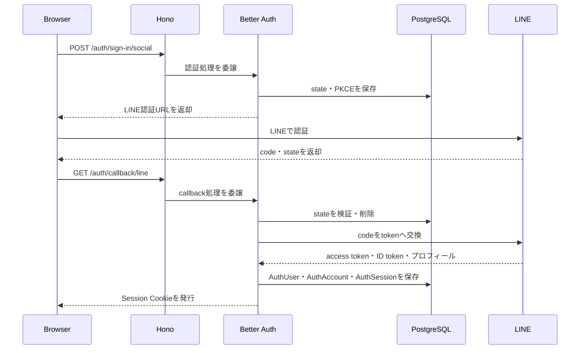
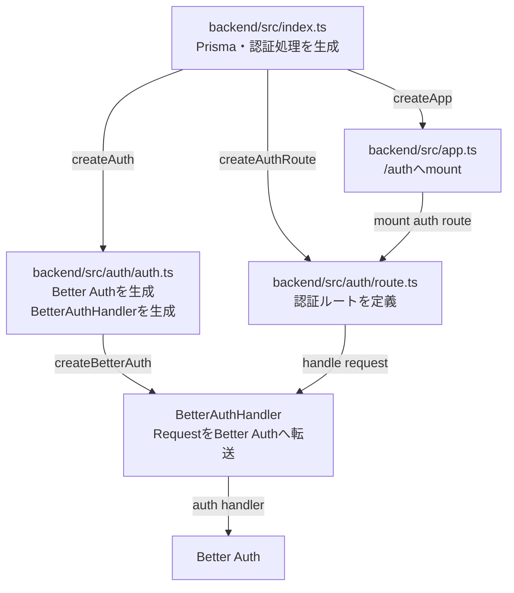

## はじめに

LINE Loginを使ったユーザー認証をBetter Authで実装してみました。
実務でフルスクラッチでOAuthの実装をしたことがあるのですが、ライブラリを使った場合はどれくらい簡略化できるのかとうのが気になり本記事を書きました。結論から言うとほとんどの処理をbetter authに委任できて設定ファイルだけで実現することできました。　

本記事では、Better Authの標準LINE Providerを使い、LINE Loginに必要な設定と実際のアプリケーションの実装を記載します。
具体的な実装は、[GitHubリポジトリ](https://github.com/HirokaMitsunaga/auth-test)に記載しています。また、実際のLINEアカウントを使ったスマホでの実機テスト手順は、[リポジトリのREADME.md](https://github.com/HirokaMitsunaga/auth-test/blob/main/README.md)にまとめています。

## なぜBetter Authなのか

TypeScriptの認証ライブラリとして、Auth.jsも候補に挙がりました。
Auth.jsは以前のNextAuth.jsにあたり、ChatGPTやGoogle Labsなどでも利用されているライブラリです。

Better Auth公式ブログでは、Auth.jsの保守・運営をBetter Authチームが引き継ぎ、
既存ユーザー向けのセキュリティ修正や緊急対応は継続する一方で、
特別な機能上の不足がない新規プロジェクトにはBetter Authを推奨すると説明されています。
そのため、今回はBetter Authを採用しました。

[Auth.js is now part of Better Auth](https://better-auth.com/blog/authjs-joins-better-auth)

## 前提

この記事では、次の前提でLINE Loginを実装します。

- `scope`は`openid profile`に限定し、`email`は含めない
  - `email`を取得しないため、LINEからメールアドレスは返されない。Better Auth 1.7.2のcallbackが要求する値には一時的なplaceholderを渡し、保存前に`NULL`へ戻す

### 実行環境

| 技術          | バージョン |
| ------------- | ---------- |
| Hono          | 4.12.31    |
| Better Auth   | 1.7.2      |
| Prisma Client | 7.8.0      |
| Prisma CLI    | 7.8.0      |
| PostgreSQL    | 18.4       |

### セキュリティ方針

今回の構成で採用している主なセキュリティ対策は次のとおりです。
OIDCの共通処理はBetter Authに委譲し、Cookieやアカウント連携に関する方針は設定で指定しています。

| 対策    | 防ぐ脅威                   | この構成での実施内容                                                               |
| ------- | -------------------------- | ---------------------------------------------------------------------------------- |
| `state` | コールバックへのCSRF攻撃   | ログイン開始時に`state`を生成・保存し、コールバック時に検証する                    |
| `PKCE`  | 認可コードインジェクション | `code_verifier`と`code_challenge`を生成し、認可コードをtokenへ交換する際に検証する |

Better Authを使うことで、state、PKCE、認可コード交換、セッション発行など認証で必要な処理を自分で実装せずに済みます。

今回、OIDCの`nonce`は扱いません。`nonce`によるID tokenの検証を追加する場合、Better Auth 1.7.2の標準LINE Providerは認可URLへ`nonce`を転
送しないため、`createAuthorizationURL`などの独自実装が必要です。[標準LINE Providerの実装](https://github.com/better-auth/better-auth
/blob/v1.7.2/packages/core/src/social-providers/line.ts#L51-L74)

### Better Authに委任している処理

Better Authは、次の処理を担当します。

- `state`とPKCEの生成・保存・検証
- LINEの認証URL生成
- 認可コードのtoken交換
- LINEのUserInfo取得
- LINEプロフィールからのユーザー情報変換
- `AuthUser`、`AuthAccount`、`AuthSession`の作成
- セッションCookieの発行
- callback URLへのリダイレクト

## 全体の処理の流れ

この図では処理の順序を示しています。



## Better Authの設定

実際の設定は[`better-auth-config.ts`](https://github.com/HirokaMitsunaga/auth-test/blob/main/backend/src/auth/infra/better-auth/better-auth-config.ts)に集約しています。
このファイルでは、Better Authの生成、Prisma adapter、セッション、Cookie、標準LINE Providerの設定値を組み立てます。

設定ファイルのコード自体は見れば確認できるため、ここでは採用した設定のをいくつかピックアップして記載します。
Better Authの各オプションの詳細は、[Better Auth公式のOptionsドキュメント](https://better-auth.com/docs/reference/options)を参照してください。

### 標準LINE Providerへ設定を追加する

`scope`に`email`を含めないため、LINEからメールアドレスは取得しないようにしています。
Better Auth 1.7.2のcallbackはメールアドレスを必須としているため、`mapProfileToUser`では一時的なplaceholder emailを渡し、ユーザー作成前のhookで`NULL`へ戻します。
placeholderは認証情報として利用せず、実際に保存されるメールアドレスは`NULL`です。

```ts
socialProviders: {
  line: {
    clientId: LINE_CLIENT_ID,
    clientSecret: LINE_CLIENT_SECRET,
    redirectURI: LINE_REDIRECT_URI,
    disableDefaultScope: true,
    scope: ['openid', 'profile'],
    mapProfileToUser: (profile) => ({
      email: `line-${profile.sub}@example.invalid`,
    }),
    disableIdTokenSignIn: true,
  },
},
```

### DB

Prisma adapterを使用し、Better Authのモデル名は次のように固定しています。

`AuthUser`、`AuthAccount`、`AuthSession`、`AuthVerification`をBetter Auth専用のテーブルとして使用します。
既存の業務テーブルや業務ロジックとは分離し、Better AuthとPrisma adapterに管理を委譲します。

設定しているテーブルの役割は次のとおりです。

| 設定           | テーブル           | 役割                                       |
| -------------- | ------------------ | ------------------------------------------ |
| `user`         | `AuthUser`         | Better Authで管理する認証ユーザー          |
| `session`      | `AuthSession`      | ログイン状態とセッションの有効期限         |
| `account`      | `AuthAccount`      | LINEなどの外部アカウントとユーザーの紐付け |
| `verification` | `AuthVerification` | 認証フローで使う一時的な検証データ         |

各テーブルの詳しいカラムや設定については、[Better Auth公式のDatabaseドキュメント](https://better-auth.com/docs/concepts/database#core-schema)を参照してください。

### セッション・Cookie・アカウント連携

- セッションの有効期限はBetter Authの設定で固定する
- Cookieは`httpOnly`、`secure`、`sameSite: 'lax'`を設定する
- `__Host-` Cookieを利用するため、`Domain`は指定しない
- ログイン後にLINE APIを呼び出さないため、Provider tokenは`AuthAccount`へ保存しない

```ts
const AUTH_SESSION_EXPIRES_IN_SECONDS = 60 * 60 * 24 * 7;
const AUTH_SESSION_UPDATE_AGE_IN_SECONDS = 60 * 60 * 24;

const AUTH_COOKIE_ATTRIBUTES = {
  httpOnly: true,
  secure: true,
  sameSite: 'lax' as const,
  path: '/',
};

betterAuth({
  session: {
    modelName: 'AuthSession',
    expiresIn: AUTH_SESSION_EXPIRES_IN_SECONDS, // ログイン後のセッション有効期限
    updateAge: AUTH_SESSION_UPDATE_AGE_IN_SECONDS, // セッション期限を延長する最小間隔
  },
  account: {
    modelName: 'AuthAccount',
    updateAccountOnSignIn: false, // 再ログイン時にProviderのtoken情報でAuthAccountを更新しない
    storeAccountCookie: false, // OAuthフロー後にProvider tokenをCookieへ保存しない
    accountLinking: {
      enabled: true,
      disableImplicitLinking: true, // OIDCログイン時の暗黙的なアカウントリンクを無効にする
    },
  },
  advanced: {
    // __Host- Cookieを使用するため、__Secure-を重ねて付けない。
    useSecureCookies: false,
    cookiePrefix: '__Host-auth',
    defaultCookieAttributes: AUTH_COOKIE_ATTRIBUTES,
    cookies: {
      session_token: {
        name: '__Host-session',
        attributes: {
          ...AUTH_COOKIE_ATTRIBUTES,
          maxAge: AUTH_SESSION_EXPIRES_IN_SECONDS,
        },
      },
    },
  },
  databaseHooks: {
    // ログイン後にLINE APIを呼び出さないため、Provider tokenをAuthAccountへ保存しない。
    account: {
      create: {
        before: clearAccountTokenFields,
      },
      update: {
        before: clearAccountTokenFields,
      },
    },
  },
});
```

## アプリケーション側の実装

アプリケーション側では、Better Authの生成とHonoへの接続だけを実装します。



依存関係は`auth/auth.ts`で生成し、`createAuthRoute()`へ`IAuthRequestHandler`として渡します。`auth/route.ts`は、受け取ったhandlerを使って認証ルートを登録し、各リクエストをBetter Authへ渡すだけです。具体的には、以下のように`POST /auth/sign-in/social`と`GET|POST /auth/callback/line`を登録します。

```ts
export const createAuthRoute = (auth: IAuthRequestHandler) => {
  const authRoute = new Hono();

  authRoute.post('/sign-in/social', (c) => auth.handle(c.req.raw));
  authRoute.on(['GET', 'POST'], '/callback/line', (c) =>
    auth.handle(c.req.raw),
  );

  return authRoute;
};
```

## まとめ

Better Authを使うことで、OIDC認証で必要になるstate、PKCE、認可コード交換、LINE Providerの処理、セッション発行などを自分で実装せずに済みました。

今回、アプリケーション側で必要になったのは、LINEのscope設定と、Better Auth 1.7.2のcallbackが要求するemailを一時的に補う設定だけです。

## 参考

1月前まではOAuthとOIDCについて何もわからない状態でしたが、[手を動かして理解する！OAuth2 / OpenID Connect の基礎と活用](https://www.udemy.com/course/oauth2-openid-connect/?srsltid=AU7gw4XZGylfKh-ghLqgYH5LfeFk3H7hzEqQ_jgoowYN8Kx4FckJ5OzQ&couponCode=26BBPAA2MX)をみて手を動かしたらかなりわかるようになりましたので念の為参考に貼っておきます
