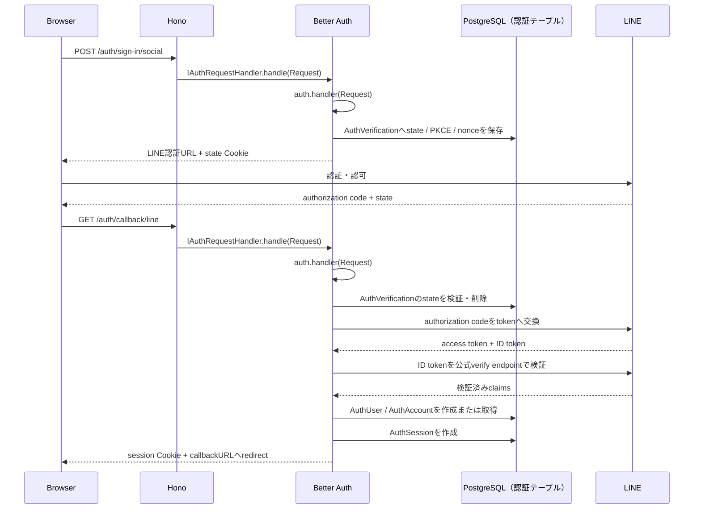

# Better Auth 処理フロー

この文書では、現在の実装でリクエストがどのように処理されるかを、アプリケーション側のコードとBetter Authへ委譲される処理に分けて説明する。

## 全体の構成

認証処理はBetter Authへ委譲する。アプリケーション側には、Better Authを生成する設定、Better Authをportへ適合させるhandler、認証ルートを置く。

```text
src/index.ts
  ↓ createAuth(prisma)
auth/auth.ts
  ↓ createBetterAuth(database)
  ↓ new BetterAuthHandler(auth)
IAuthRequestHandler
  ↓ createApp({ db, auth })
auth/route.ts
  ↓ createAuthRoute(auth)
app.ts
  ↓ app.route('/auth', authRoute)
BetterAuthHandler.handle(request)
  ↓ auth.handler(request)
Better Auth internal router
```

`auth/controller` に認証用controllerは作成しない。`auth/route.ts`では現在利用するBetter Authのエンドポイントだけを明示的に登録し、処理自体はBetter Authのhandlerへそのまま渡す。認証処理の前後にアプリケーション固有の処理が必要になった場合だけ、対象の処理に対応するusecaseを追加する。

## 起動時の依存注入

実行時の依存関係は `backend/src/index.ts` で組み立てる。

```ts
const auth = createAuth(prisma);

const app = createApp({
  db: prisma,
  auth,
});
```

`createAuth()` 内の `createBetterAuth()` は次を設定する。

- Prisma adapter
- `AuthUser`、`AuthAccount`、`AuthSession`、`AuthVerification` のmodel名
- Sessionの有効期限
- Cookie属性
- account tokenの保存禁止hook
- LINE provider plugin

`app.ts` はBetter Authの具体実装を生成せず、生成済みの `IAuthRequestHandler` を認証ルートへ渡すだけにする。

## 認証リクエスト共通経路

`backend/src/auth/route.ts` は、現在利用するBetter AuthのエンドポイントをパスとHTTPメソッドごとに登録する。`backend/src/app.ts` は認証ルートを`/auth`へmountするだけである。

```ts
const authRoute = createAuthRoute(auth);
app.route('/auth', authRoute);
```

`createAuthRoute`でBetter Authへ転送する経路は次のとおりである。

```text
POST /auth/sign-in/social
GET|POST /auth/callback/line
```

その後の処理は次のとおりである。

```text
Hono
  → authRouteのパス・HTTPメソッド分岐
      → IAuthRequestHandler.handle()
      → BetterAuthHandler.handle()
        → auth.handler(request)
          → Better AuthがURLとHTTPメソッドに応じて処理
```

`/auth`をBetter Auth専用のmount pointとし、`auth/route.ts`を認証エンドポイントのallowlistとして扱う。現状はログイン開始とLINE callbackだけを公開し、定義していないパスやHTTPメソッドはBetter Authへ転送せず、Honoが404を返す。Better Authの設定やprovider、pluginによって新しいエンドポイントを公開する場合は、`auth/route.ts`にも明示的な分岐を追加する。

## 全体シーケンス



図の `PostgreSQL（認証テーブル）` は、Better Authが利用する `AuthUser`、`AuthAccount`、`AuthSession`、`AuthVerification` を表す。既存の業務用 `User` テーブルはこの認証フローでは使用しない。

## ログイン開始: 認証URLの生成

### 1. リクエスト

クライアントはBetter Authのsocial sign-in endpointを呼び出す。

```http
POST /auth/sign-in/social
Content-Type: application/json

{
  "provider": "line",
  "callbackURL": "/login-complete"
}
```

アプリケーション側の呼び出し順は次のとおりである。

```text
POST /auth/sign-in/social
  → app.ts の app.route('/auth', authRoute)
  → auth/route.ts の POST /sign-in/social
  → BetterAuthHandler.handle(request)
  → auth.handler(request)
  → Better Auth /sign-in/social endpoint
```

### 2. providerの解決

Better Authはリクエストの `provider` を使って、設定済みのsocial providerを検索する。

```ts
const provider = socialProviders.find(
  (provider) => provider.id === body.provider,
);
```

今回の `line` providerは `backend/src/auth/infra/better-auth/line-provider.ts` のpluginから登録される。

```ts
plugins: [
  createLineProviderPlugin({
    clientId: LINE_CLIENT_ID,
    clientSecret: LINE_CLIENT_SECRET,
    redirectURI: LINE_REDIRECT_URI,
  }),
],
```

未登録のproviderが指定された場合、認証URLは生成せずエラーになる。

### 3. state、PKCE、nonceの生成

LINE providerは `requiresIdTokenNonce: true` なので、Better Authがnonceを生成する。

```ts
const idTokenNonce = generateIdTokenNonce(provider);
```

続いてBetter AuthがstateとPKCEの値を生成する。

```ts
const { state, codeVerifier } = await generateState(c, {
  additionalData: c.body.additionalData,
  idTokenNonce,
});
```

`generateState()` は次の情報をstateデータとして作成する。

```ts
{
  callbackURL,
  codeVerifier,
  idTokenNonce,
  expiresAt,
  oauthState: state,
}
```

DB保存構成では、次のように `AuthVerification` へ保存する。

```text
identifier: state
value: JSON.stringify({
  callbackURL,
  codeVerifier,
  idTokenNonce,
  expiresAt,
  oauthState: state,
})
```

同時に署名付きCookieも発行される。

```text
__Host-auth.state=<state>
```

ブラウザーへ返す認証URLには `codeVerifier` そのものを含めず、`codeVerifier` から生成した `code_challenge` を含める。

### 4. LINE認証URLの生成

Better Authはproviderの `createAuthorizationURL()` を呼び出す。

```ts
const url = await provider.createAuthorizationURL({
  state,
  codeVerifier,
  idTokenNonce,
  redirectURI: `${baseURL}/callback/line`,
});
```

LINE providerは認可エンドポイント、scope、state、PKCE、nonceを指定してURLを生成する。

```ts
createAuthorizationURL: (params) =>
  createAuthorizationURL({
    id: 'line',
    options: {
      clientId: config.clientId,
      clientSecret: config.clientSecret,
      redirectURI: config.redirectURI,
    },
    authorizationEndpoint:
      'https://access.line.me/oauth2/v2.1/authorize',
    scopes: ['openid', 'profile'],
    state: params.state,
    codeVerifier: params.codeVerifier,
    redirectURI: params.redirectURI,
    nonce: params.idTokenNonce,
  }),
```

生成されるURLの例:

```text
https://access.line.me/oauth2/v2.1/authorize
  ?response_type=code
  &client_id=...
  &redirect_uri=http://localhost:3000/auth/callback/line
  &scope=openid+profile
  &state=...
  &code_challenge=...
  &code_challenge_method=S256
  &nonce=...
```

`client_secret` は認証URLには含まれない。Better Authは認可コードをtokenへ交換するcallback処理でだけ使用する。

### 5. レスポンス

Better Authは認証URLをレスポンスへ設定する。

```ts
return c.json({
  url: url.toString(),
  redirect: true,
});
```

このレスポンスにはstate Cookieも含まれる。クライアントまたはブラウザーは返されたURLへ移動し、LINEの認証画面を表示する。

## callback: 認可コードの受信と検証

### 1. callbackリクエスト

LINEでの認証が完了すると、ブラウザーは次のURLへ移動する。

```http
GET /auth/callback/line?code=xxx&state=yyy
Cookie: __Host-auth.state=yyy
```

アプリケーション側では開始時と同じhandler経路を通る。

```text
GET /auth/callback/line
  → app.ts の app.route('/auth', authRoute)
  → auth/route.ts の GET /callback/line
  → BetterAuthHandler.handle(request)
  → auth.handler(request)
  → Better Auth /callback/:id endpoint
```

### 2. callbackパラメータの確認

Better AuthはqueryまたはPOST bodyから次の値を読み取る。

```ts
const {
  code,
  state,
  error,
  error_description,
} = queryOrBody;
```

`state`が存在しない場合や`code`が存在しない場合は、認証失敗としてエラーURLへリダイレクトする。

### 3. stateの検証

Better Authの `parseState()` が次を行う。

```text
1. callbackのstateでAuthVerificationを検索
2. DBに保存したoauthStateとcallbackのstateを比較
3. 署名付きCookieのstateとcallbackのstateを比較
4. codeVerifier、callbackURL、idTokenNonceを取り出す
5. stateの有効期限を確認
6. state Cookieを削除
7. AuthVerificationを削除
```

検証に失敗した場合、token endpointへ進まない。

ここで取り出した値が、ログイン開始時に作成した値とcallbackを結び付ける。

```ts
const {
  codeVerifier,
  callbackURL,
  idTokenNonce,
} = await parseState(c);
```

### 4. providerの解決とnonce確認

callback URLの `:id` からproviderを解決する。

```ts
const provider = socialProviders.find(
  (provider) => provider.id === c.params.id,
);
```

今回のURLでは次の値になる。

```text
c.params.id === "line"
```

LINE providerはnonce必須なので、stateからnonceを取得できない場合は失敗する。

```ts
if (provider.requiresIdTokenNonce && !idTokenNonce) {
  // nonce binding missing
}
```

### 5. 認可コードをtokenへ交換

Better Authはproviderの `validateAuthorizationCode()` を呼び出す。

```ts
const tokens = await provider.validateAuthorizationCode({
  code,
  codeVerifier,
  redirectURI: `${baseURL}/callback/line`,
});
```

LINE providerは標準LINE providerの実装を利用する。LINEのtoken endpointへ次の値を送る。

```text
grant_type=authorization_code
code=xxx
code_verifier=開始時に保存したcodeVerifier
redirect_uri=...
client_id=...
client_secret=...
```

この段階でLINEからaccess token、ID token、必要に応じてrefresh tokenを受け取る。ただし、今回の用途は認証だけなので、ログイン後にprovider APIを呼び出すためのtokenとしては利用しない。

### 6. ID tokenとユーザー情報の検証

token交換後、Better Authはproviderの `getUserInfo()` を呼び出す。

```ts
const providerResult = await provider.getUserInfo({
  ...tokens,
  expectedIdTokenNonce: idTokenNonce,
});
```

LINE providerでは `getUserInfo()` を独自実装し、LINE公式verify endpointを呼び出す。

```ts
const claims = await verifyLineIdToken({
  token: tokens.idToken,
  clientId: config.clientId,
  expectedNonce: tokens.expectedIdTokenNonce,
});
```

verify endpointへのリクエストは次のとおりである。

```ts
await fetch('https://api.line.me/oauth2/v2.1/verify', {
  method: 'POST',
  body: new URLSearchParams({
    id_token: params.token,
    client_id: params.clientId,
    nonce: params.expectedNonce,
  }),
});
```

LINEから返されたclaimsについて、アプリケーション側でも次を確認する。

```text
iss === https://access.line.me
aud === LINE_CLIENT_ID
subが空でない
expが現在時刻より未来
iatが未来すぎない
nonceが開始時のnonceと一致
```

署名の検証自体はLINE公式verify endpointの責務である。verify endpointが失敗した場合、またはclaims検証に失敗した場合はuser情報を返さず、Better Authはログインを失敗させる。

検証に成功すると、LINE claimsをBetter Authのuser情報へ変換する。

```ts
return {
  user: {
    name: claims.name ?? '',
    email: `line-${claims.sub}@example.invalid`, // callback通過用の一時値。DB保存前にNULL化する
    image: claims.picture,
    emailVerified: false,
  },
  data: claims,
};
```

### 7. AccountとUserの解決

Better Authはproviderの情報から外部アカウントの識別子を作る。

```text
issuer   = https://access.line.me
accountId = ID tokenのsub
```

この組み合わせで `AuthAccount` を検索する。

```text
AuthAccount
  issuer: https://access.line.me
  accountId: <LINE subject>
```

既存のAccountがあれば紐付いたAuthUserを利用し、なければBetter AuthがAuthUserとAuthAccountを作成する。

Account作成時にはtoken情報も内部的には渡されるが、`databaseHooks.account.create.before` に登録したhookによって、保存前に次の値を `NULL` にする。

```text
accessToken
refreshToken
idToken
accessTokenExpiresAt
refreshTokenExpiresAt
scope
```

### 8. Session発行とリダイレクト

UserとAccountの処理が完了すると、Better Authは次を行う。

```text
1. AuthSessionを作成
2. __Host-session Cookieを発行
3. callbackURLへリダイレクト
```

Sessionの有効期限は `better-auth-config.ts` の `session.expiresIn` で決まる。これは認証URLの有効期限ではなく、ログイン成功後のアプリケーションSessionの有効期限である。

## 処理の責務

| 処理 | 担当 |
| --- | --- |
| Better Authエンドポイントのパス・HTTPメソッド分岐 | `auth/route.ts` |
| `/auth`への認証routeのmount | `app.ts` |
| Better AuthへのRequest/Response接続 | `BetterAuthHandler` |
| OAuth URL、state、PKCE、nonce | Better Auth |
| LINE認証URLの固定設定 | `line-provider.ts` |
| 認可コードからtokenへの交換 | Better AuthのLINE provider |
| LINE ID tokenの公式verify endpoint呼び出し | `line-provider.ts` |
| User、Account、Sessionの保存 | Better Auth + Prisma adapter |
| Account tokenの保存禁止 | `account-token-policy.ts` |

この構成では、アプリケーション側でOAuthの認証URL生成、callbackのtoken交換、state検証、ID token検証を再実装しない。
