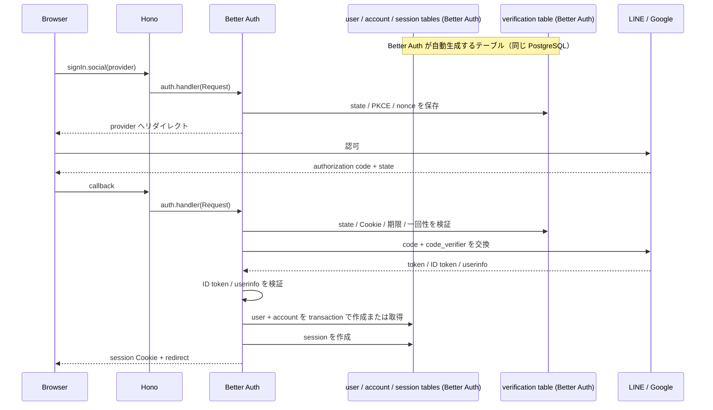
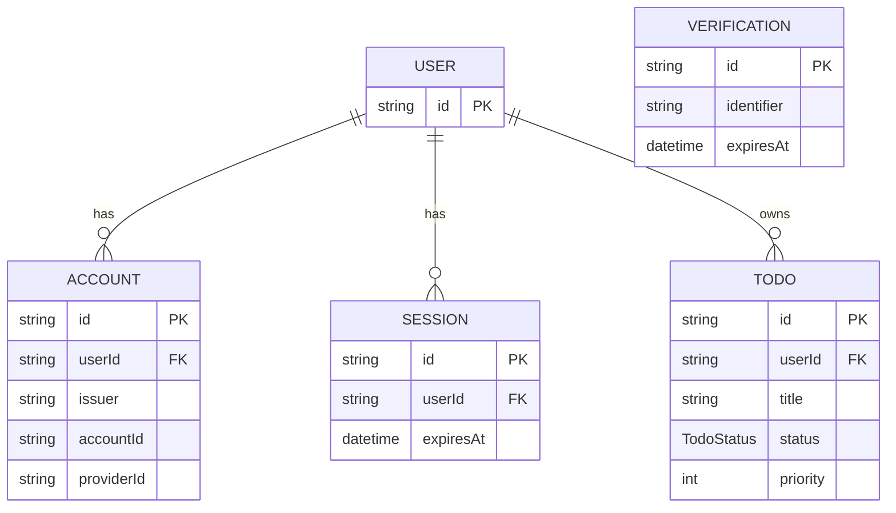
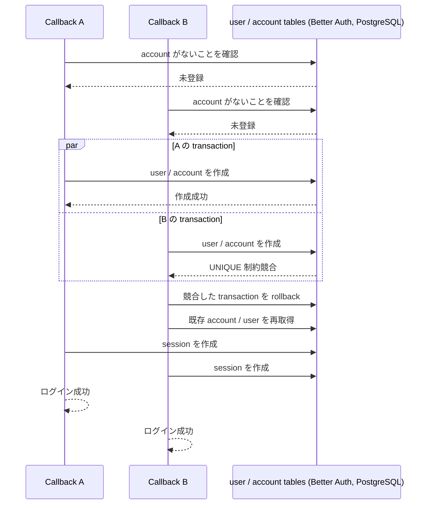

# Auth（Better Auth 採用）

## 目的

LINE Login と Google Login を入口とする認証を Better Auth に委譲し、アプリケーション側では認証済みユーザーを Todo などのドメイン処理へ安全に接続する。

フルスクラッチ実装で必要だった OAuth/OIDC の state、PKCE、nonce、認可コード交換、ID トークン検証、認証 ID の保存、セッション発行を Better Auth の責務とする。そのうえで、次のようなアプリケーション固有のポリシーは本システム側で明示的に管理する。

- ログインを許可するプロバイダー
- アカウントの自動リンクを許可するか
- 外部プロバイダーのトークンを保存するか
- User と Todo のデータ移行
- 初回ログイン時の同一ユーザー競合時のリトライ方針
- 認証済みユーザーに対するアプリケーションの認可

Better Auth は認証基盤であり、アプリケーションの認可やユーザー固有データの業務ルールを代替するものではない。

## 前提

- ブラウザからバックエンドへリダイレクトしてログインする。
- バックエンドは Hono を使用する。
- DB は PostgreSQL、ORM は Prisma を使用する。
- 外部プロバイダーは当初 LINE と Google を対象とする。
- Cognito などのマネージド認証基盤は使用しない。
- アプリケーションのログインセッションは Better Auth のセッションを使用する。
- LINE や Google のアクセストークンを、アプリケーションのログインセッションとして扱わない。
- 認証処理の依存バージョンを package.json で固定し、アップデート時は認証フローの結合テストを実行する。

Better Auth 公式には通常版の Hono 統合ドキュメントと、別URLの Beta 版ドキュメントが存在する。Hono 公式の Better Auth 例自体には、Hono 統合が Beta であるという記載はない。採用時は package.json で固定した Better Auth のバージョンに対応するドキュメントと API を確認し、最小構成の疎通を行う。Hono では Better Auth の handler を既存ルーターへ直接マウントできるため、必要以上に独自の HTTP アダプターを追加しない。

## Better Auth とアプリケーションの責務分担

| 領域 | Better Auth に任せる処理 | アプリケーション側で決める処理 |
| --- | --- | --- |
| OAuth/OIDC | 認可 URL、state、PKCE、nonce、コールバック、トークン交換 | 利用する provider と設定値の管理 |
| ID トークン | issuer、audience、署名、期限、nonce などの検証 | 検証済みユーザー情報を業務でどう利用するか |
| 外部 ID | issuer と accountId による identity の保存 | email だけでの自動リンクを禁止するか |
| ユーザー | Better Auth User の作成・更新 | 表示名・プロフィール・退会などの業務ルール |
| セッション | セッション発行、Cookie、取得、失効 | アプリ API での認証必須範囲と認可 |
| DB | user、account、session、verification の永続化 | Todo などのドメインテーブルと外部キー |
| 競合 | ユーザー・アカウント作成のトランザクション | 一意制約競合時に再取得してログイン継続できるか |
| 秘密情報 | 秘密値を使用した認証処理 | 秘密値の注入、ローテーション、ログへの出力禁止 |

state や PKCE をアプリケーションのコールバックルートで再実装しない。Better Auth の内部仕様に依存する処理を独自実装すると、検証済みの状態を二重に管理して不整合を起こすためである。

## 構成

### ディレクトリ

Better Auth 固有の設定と、アプリケーション固有の認証利用コードを分離する。

    backend/src/auth/
    ├── controller/
    │   └── http/
    │       ├── auth.route.ts
    │       └── require-authenticated-user.middleware.ts
    ├── port/
    │   ├── auth-handler.interface.ts
    │   └── auth-session-reader.interface.ts
    ├── infra/
    │   └── better-auth/
    │       ├── better-auth-config.ts
    │       ├── better-auth-handler.ts
    │       ├── better-auth-session-reader.ts
    │       └── hooks/
    │           ├── account-token-policy.ts
    │           └── user-policy.ts
    ├── integration-test/
    │   ├── better-auth-flow.test.ts
    │   ├── account-linking.test.ts
    │   ├── concurrent-first-login.test.ts
    │   └── session.test.ts
    └── docs/
        ├── full-scratch.md
        └── better-auth.md

command の構成を参考に HTTP controller、port、infra を分離する。ただし、この auth モジュール自体は認証の業務ドメインを解決するものではない。そのため auth 配下に domain や、単なる委譲になる usecase、composition 専用ディレクトリは作成せず、アプリケーションとの契約を port に定義する。

Better Auth の handler は外部ライブラリの実装詳細なので、controller から直接 Better Auth を呼ばず、port 経由で呼び出す。

better-auth-config.ts は Better Auth の設定と Prisma adapter の組み立てだけを担当する。認証処理、user の業務ルール、HTTP の分岐、競合リトライをこのファイルへ詰め込まない。better-auth-handler.ts と better-auth-session-reader.ts が、それぞれ auth.handler と auth.api.getSession を port の実装として公開する。

command の todo-command.route.ts と同じく、auth.route.ts を依存性の組み立て場所とする。auth.route.ts が Better Auth の設定、handler、session reader を生成し、auth.route.ts と require-authenticated-user.middleware.ts へ port の実装を注入する。PrismaClient を参照してよいのは controller の組み立て部分と infra に限る。

### 依存方向

    controller/http
        ├─ route の定義
        ├─ port の実装を生成・注入
        └──────────────→ port ←──────── infra/better-auth

    infra/better-auth
        ├─ Better Auth handler / API
        └─ Prisma adapter
                    ↓
                PostgreSQL

    アプリケーションの認証必須 API
        ↓
    IAuthSessionReader
        ↓
    BetterAuthSessionReader
        ↓
    Better Auth API（セッション取得）

port と controller の処理部分は PrismaClient、@prisma/client、Prisma の generated type、Better Auth の database model に依存しない。auth.route.ts の依存性を組み立てる箇所だけは infra の実装を参照してよい。DB と Better Auth の依存は infra に閉じ込め、port ではアプリケーションが必要とする型とインターフェースだけを定義する。

command のドメイン層から Prisma の account や session を直接検索しない。Todo などの業務ドメインは command 側に置き、認証済みユーザーの識別だけを IAuthSessionReader 経由で取得する。

### 各レイヤーの責務

#### controller/http

- Hono の route と middleware を定義する。
- HTTP の Request を handler port または session reader port へ渡す。
- 認証されていない場合の 401 など、HTTP レスポンスへ変換する。
- auth.route.ts の依存性を組み立てる箇所では infra の実装を参照してよい。
- route の処理本体と middleware は Prisma、Prisma adapter、Better Auth の account/session 型を直接参照しない。

#### port

- controller と外部実装の境界を定義する。
- 認証済みユーザーの最小 DTO とインターフェースを公開する。
- PrismaClient や Better Auth の型を引数・戻り値にしない。
- 現在は IAuthHandler と IAuthSessionReader を定義する。AuthenticatedUser もこの port の契約として定義する。

    export interface IAuthHandler {
      handle(request: Request): Promise<Response>;
    }

Better Auth が所有する user、account、session、verification については、現時点でアプリケーション独自の repository interface を作成しない。Better Auth の API と Prisma adapter が読み書きを担当するため、アプリケーションが直接 DB 操作を必要とするユースケースが発生した時だけ、そのユースケースに必要な最小の port を追加する。

#### infra/better-auth

- Better Auth の設定、Prisma adapter、Hono handler との接続を実装する。
- IAuthHandler と IAuthSessionReader を実装する。
- token 保存ポリシーなど Better Auth hook の具体実装を置く。
- Prisma と Better Auth の型を参照してよい唯一の認証実装層とする。

### 既存 command との関係

- Todo の作成・更新・削除は、引き続き command の domain、port、usecase、infra を使用する。
- Todo の controller は認証 middleware が設定した AuthenticatedUser から user.id を取得し、リクエストの userId を信用しない。
- 現在の command の User repository と password 前提の User usecase は、Better Auth の user/account 管理と責務が重複する。
- Better Auth へ移行した後は、command の User CRUD をそのまま認証用に残さず、必要ならプロフィール管理用の別 usecase として再設計する。

### フルスクラッチ実装との差分

次のファイルや責務は Better Auth 採用時には新規作成しない。

- start-login.use-case.ts
- complete-login.use-case.ts
- external-auth-provider.interface.ts
- AuthLoginAttempt 用のリポジトリ
- AuthSession 用のリポジトリ
- provider ごとの認可コード交換処理
- provider ごとの JWKS 取得・署名検証処理
- state、code_verifier、nonce の暗号化処理

一方で、プロバイダー設定、Cookie 属性、アカウントリンク方針、外部トークンの保存方針、初回ログイン競合の受け入れ条件は、ライブラリに任せるだけでは仕様にならないため、本設計書で固定する。

## 依存関係と設定

### 依存ライブラリ

必要な依存は次のとおりとする。

- better-auth
- @better-auth/prisma-adapter

LINE と Google のためにプロバイダーごとの OAuth SDK を追加しない。Better Auth の social provider または Generic OAuth の機能を使用する。

依存ライブラリを追加する前に、現在の Node.js、Hono、Prisma のバージョンと Better Auth の対応状況を確認する。現時点で Better Auth は既存の package.json に含まれていないため、実装時にバージョンを決定し、lockfile まで更新する。

### 設定例

以下は設定の責務を示す概念例であり、実装時は採用バージョンの型定義と公式ドキュメントに合わせる。

配置先は infra/better-auth/better-auth-config.ts とする。このファイルは Better Auth の設定と Prisma adapter の組み立てだけを担当し、認証処理や HTTP レスポンスの処理は持たない。

    export const auth = betterAuth({
      baseURL: env.AUTH_BASE_URL,
      basePath: "/api/auth",
      secret: env.BETTER_AUTH_SECRET,
      trustedOrigins: env.AUTH_TRUSTED_ORIGINS,
      database: prismaAdapter(prisma, {
        provider: "postgresql",
      }),
      socialProviders: {
        line: {
          clientId: env.LINE_CLIENT_ID,
          clientSecret: env.LINE_CLIENT_SECRET,
          scope: ["openid", "profile", "email"],
        },
        google: {
          clientId: env.GOOGLE_CLIENT_ID,
          clientSecret: env.GOOGLE_CLIENT_SECRET,
          scope: ["openid", "profile", "email"],
        },
      },
      account: {
        accountLinking: {
          enabled: true,
          disableImplicitLinking: true,
        },
      },
    });

上記の設定で実際の Cookie 名、token 保存、フックの設定方法が採用バージョンと一致することを、型チェックと結合テストで確認する。

### 環境変数

最低限、次の値を環境変数などのサーバー専用の秘密管理機構から注入する。

- BETTER_AUTH_SECRET
- AUTH_BASE_URL
- AUTH_TRUSTED_ORIGINS
- LINE_CLIENT_ID
- LINE_CLIENT_SECRET
- GOOGLE_CLIENT_ID
- GOOGLE_CLIENT_SECRET
- DATABASE_URL

client_secret はリクエストパラメータ、Cookie、DB の user/account レコード、URL、アプリケーションログのいずれにも保存しない。サーバー起動時に設定を読み込み、未設定または不正な形式なら起動時に失敗させる。

Better Auth の秘密鍵をローテーションする場合は、旧鍵を短期間だけ検証用に残せる設定を利用する。旧 Cookie を突然すべて無効化するか、段階的に移行するかを運用方針として決め、環境変数を更新する順序を手順化する。

## Hono への組み込み

### 認証ルートのマウント

auth.route.ts は Hono の認証用パスを定義し、IAuthHandler の実装へ処理を委譲する。controller から Better Auth の auth.handler を直接呼び出さない。

    export const createAuthRoute = ({
      app,
      authHandler,
    }: {
      app: Hono;
      authHandler: IAuthHandler;
    }) => {
      app.all("/api/auth/*", (c) => authHandler.handle(c.req.raw));
    };

better-auth-handler.ts が IAuthHandler を実装し、その内部で Better Auth の auth.handler を呼び出す。auth.route.ts が BetterAuthHandler を生成して createAuthRoute に注入する。

認証ルートには、アプリケーションの通常の JSON バリデーションや認証必須ミドルウェアを重ねない。Better Auth が要求する GET/POST とリクエスト本文をそのまま通す。

認証ルートより先に、リクエスト本文を読み捨てるミドルウェアや別の CORS 処理を置かない。フロントエンドとバックエンドが異なる Origin になる場合は、許可する Origin を trustedOrigins と CORS の両方で明示する。ワイルドカードやリクエストの Origin をそのまま反映する設定は使用しない。

### アプリケーション API からのセッション取得

Todo API などの認証必須ルートでは、require-authenticated-user.middleware.ts から IAuthSessionReader を呼び出す。controller から Better Auth のセッション API を直接呼び出さず、port 経由で取得する。

    const authenticatedUser =
      await authSessionReader.getAuthenticatedUser({
        headers: c.req.raw.headers,
      });

    if (!authenticatedUser) {
      return c.json({ message: "Unauthorized" }, 401);
    }

    c.set("authenticatedUser", authenticatedUser);

better-auth-session-reader.ts が IAuthSessionReader を実装し、内部で Better Auth の auth.api.getSession を呼び出す。BetterAuthSessionReader は Better Auth の user/session 型から port で定義した AuthenticatedUser DTO へ変換する。

    export interface IAuthSessionReader {
      getAuthenticatedUser(params: {
        headers: Headers;
      }): Promise<AuthenticatedUser | undefined>;
    }

    export type AuthenticatedUser = {
      id: string;
    }

この port と middleware は PrismaClient、@prisma/client、Better Auth の user/session 型を参照しない。認証済み user に業務上の属性や権限を追加する場合は、Todo などの業務ドメイン側で別途定義する。

以下は better-auth-session-reader.ts の内部処理であり、port や controller には置かない。

    const session = await auth.api.getSession({
      headers: request.headers,
    });

session が存在しない、期限切れ、失効済みの場合は 401 を返す。セッションの user.id を Todo の userId として利用し、クライアントから送られた userId は採用しない。

認証判定の結果を URL パラメータや hidden field などのクライアント入力から復元しない。

## ログインフロー

### 1. ログイン開始

ログイン画面から Better Auth のソーシャルログイン API を呼び出す。provider は固定の allowlist から選び、クライアントが任意の providerId、認可 URL、redirectURI、scope を指定できないようにする。

    await authClient.signIn.social({
      provider: "line",
      callbackURL: "/",
    });

サーバー側では Better Auth が次の処理を行う。

1. provider 設定を解決する。
2. state、PKCE の code_verifier/code_challenge、必要な nonce を生成する。
3. state 検証用の情報を Better Auth の設定された保存先へ保存する。
4. state と Cookie の改ざんを検証できる形でブラウザへ渡す。
5. provider の認可エンドポイントへリダイレクトする。

DB が利用できる構成では、state の保存戦略は database を基本とする。Better Auth が管理する state 用の検証レコードや Cookie を、アプリケーションが独自の AuthLoginAttempt として二重保存しない。

ログイン開始時にアプリケーションが保存してよいのは、ログイン後に戻す画面などの業務上必要な値だけである。戻り先は任意 URL を受け取らず、内部パスの allowlist で検証する。

### 2. provider の認可

ブラウザは provider の認可画面へ移動する。

- redirect_uri は provider 管理画面の設定と完全一致させる。
- scope は設定ファイルで固定する。
- PKCE の code_challenge は Better Auth が生成した値を使用する。
- state と nonce はクライアントから別の値に差し替えられない。
- provider の URL へ client_secret を送らない。

認可 URL をアプリケーションで組み立てる処理を追加しない。追加のパラメータが必要な provider は、Better Auth の provider 設定または Generic OAuth の拡張点で表現する。

### 3. コールバック

provider は Better Auth のコールバック URL へ認可コードと state を返す。

Better Auth は次の処理を行う。

1. state と検証用 Cookie、保存済みの state 情報を照合する。
2. state の期限、利用済み状態、provider を確認する。
3. code_verifier を使用して認可コードを交換する。
4. provider の設定に基づいて ID トークンと userinfo を検証する。
5. provider の issuer と subject などから account を特定する。
6. 未登録なら user と account を作成し、既存なら既存 user に紐付ける。
7. Better Auth の session を作成する。
8. アプリケーションの Cookie を設定し、指定された内部 URL へ戻す。

アプリケーションのコールバックルートは、認可コードを受け取って独自に token endpoint を呼び出さない。provider のエラーレスポンスをそのまま画面へ表示せず、外部には一般化したログイン失敗を返す。

### フロー図

### 同じログイン試行の再送

同じ callback URL の再読み込み、戻る操作、プロキシによる再送では、state の一回性と検証情報の有効期限によって再利用を拒否する。成功済み callback をもう一度処理してセッションを二重発行しない。

アプリケーション側で callback の二重実行を防ぐための独自ロックを先に追加しない。Better Auth の状態管理と DB の一意制約を利用し、採用バージョンで再送が一度だけ成功することを結合テストで確認する。

## provider 設計

### LINE

LINE は Better Auth の LINE provider を使用する。openid、profile、必要な場合だけ email を scope に含める。email が取得できない利用者を、email の有無だけを理由に拒否しない。

LINE の channel が複数ある場合は providerId を固定して別の Generic OAuth provider として登録するなど、認証 ID が衝突しない構成にする。リクエストから channelId を受け取って clientId や clientSecret を動的に切り替えない。

### Google

Google は Better Auth の Google provider を使用する。clientId、clientSecret、redirectURI、scope はサーバー設定で固定する。

Google の email が verified であっても、既存の別 provider identity と自動統合する根拠にはしない。アカウントリンクは後述の明示操作だけで行う。

### Generic OAuth

標準 provider で表現できない OIDC provider は Generic OAuth を使用する。issuer、authorization endpoint、token endpoint、userinfo endpoint、JWKS の取得元、許可する署名アルゴリズムをサーバー設定で固定する。

Generic OAuth の設定で ID トークン検証を無効化しない。provider 固有に userinfo の取得が必要な場合も、userinfo のレスポンスを認証済み ID トークンの代替として無条件に信頼しない。

## provider 設定スナップショットと client_secret

### 静的設定を基本とする

フルスクラッチ実装ではログイン試行ごとに providerConfigVersion を保存して、開始時と callback 時の設定を一致させた。Better Auth 採用時は、通常の構成では provider 設定を認証サーバーの静的設定として扱い、ログイン試行テーブルに独自のスナップショットを追加しない。

次の値は全て同じ設定セットとして管理する。

- providerId
- issuer
- authorization endpoint
- token endpoint
- userinfo endpoint
- clientId
- clientSecret
- redirectURI
- scope
- PKCE の設定
- ID トークン検証の設定
- JWKS の信頼先
- 許可する署名アルゴリズム

ロードバランサー配下の全バックエンドが同じ provider 設定を使用する。インスタンスごとに異なる clientId、redirectURI、issuer を持たせない。

### 設定変更中の callback

clientSecret や JWKS の鍵をローテーションする場合、古いログイン開始が TTL 内に callback される可能性を考慮する。

- secret は新旧を同時に扱える Better Auth の秘密鍵ローテーション機能を使用する。
- provider の client secret は provider 側で旧値を有効にできる期間を確認する。
- redirectURI、issuer、clientId を変更する場合は、旧設定の callback を受ける期間を明示する。
- 設定の切り替えを一度に行う場合は、切り替え前後の callback 失敗を運用上許容できるか決める。

「開始時の設定」と「callback 時の設定」を厳密に固定する必要がある動的マルチテナント構成では、Better Auth の標準設定だけで実現しようとしない。テナントごとの provider 設定を扱う拡張実装を作るか、provider ごとに認証サーバーを分離するかを別途設計する。

### client_secret の禁止事項

- ブラウザに返さない。
- 認可 URL に含めない。
- state や verification レコードに保存しない。
- account や session の通常フィールドに保存しない。
- エラーオブジェクトや HTTP ログへ含めない。
- provider 設定をクライアント入力で上書きしない。

## Cookie 属性

### セッション Cookie

セッション Cookie は次の属性に固定する。

| 属性 | 値 |
| --- | --- |
| Name | __Host-session |
| Path | / |
| Domain | 設定しない |
| Secure | 常に有効。本番と HTTPS の検証環境で使用 |
| HttpOnly | 有効 |
| SameSite | Lax |
| Max-Age | Better Auth のセッション有効期限と一致 |

__Host- プレフィックスを使用するため、Domain を設定せず、Path を / とする。Better Auth の Cookie 設定 API でこの名前と属性を明示する。設定 API の実際のキー名は採用バージョンの型定義に合わせ、デフォルト値に依存しない。

HTTP のローカル開発環境では Secure Cookie が送信されないため、開発環境を HTTP のままにする場合は、開発専用の Cookie 設定を明示する。本番設定の Secure を無効化することで動作確認しない。可能ならローカルも HTTPS とする。

### state 検証用 Cookie

state、PKCE、nonce を保持する検証用 Cookie は Better Auth が管理する。Better Auth の状態保存を利用するため、アプリケーションが独自に __Host-auth-flow を発行しない。

state 用 Cookie についても、採用バージョンで次の条件を確認する。

- HttpOnly が有効である。
- Secure が本番で有効である。
- SameSite は OAuth のクロスサイトリダイレクトを妨げない Lax を基本とする。
- Domain は指定しない。
- Path は認証ルートを含むパスに一致する。
- 有効期限が短く、callback 完了または失敗後に削除される。

Better Auth のデフォルト属性を採用する場合でも、生成された Set-Cookie を結合テストで確認する。Cookie 名や属性を変更した後に、state 検証 Cookie と session Cookie を同じ名前へ設定しない。

### Cookie に入れない値

- client_secret
- provider access token
- provider refresh token
- ID token
- 認証済みと判定するだけの user.id
- 任意の戻り先 URL

## DB 設計

### テーブルの所有者と生成方法

今回の構成では、Better Auth のプラグインで追加の認証機能を有効化しない。Better Auth の core schema として、次の4テーブルを使用する。

| テーブル | 所有者 | 生成・反映 | 用途 |
| --- | --- | --- | --- |
| user | Better Auth | Better Auth CLI が Prisma schema を生成し、Prisma migration で反映 | アプリケーションユーザー |
| account | Better Auth | 同上 | LINE / Google などの外部 identity |
| session | Better Auth | 同上 | アプリケーションのログインセッション |
| verification | Better Auth | 同上 | OAuth state などの一時的な検証情報 |

ここでいう「自動生成」は、Better Auth が Prisma のモデル定義を生成することを指す。Prisma adapter を使う場合、生成された schema を確認したうえで、このリポジトリの Prisma migration を作成して DB にテーブルを作る。Better Auth の schema 生成だけで本番 DB にテーブルが自動作成されるわけではない。

Better Auth のプラグインを将来追加する場合は、プラグイン固有のテーブルが増える可能性がある。その場合は、プラグイン名、追加テーブル、保存データ、削除・期限管理を別途この一覧へ追加する。現時点では追加プラグインを使用しないため、認証用途の独自テーブルは作成しない。

### Better Auth の標準テーブル

Better Auth の論理モデルは次のテーブルを基本とする。実際のカラム名、型、インデックスは採用バージョンの Prisma schema generator が出力する内容を基準にする。

#### user

| カラム | 用途 |
| --- | --- |
| id | アプリケーション全体で不変なユーザー ID |
| name | Better Auth の表示名 |
| email | provider から取得した email。ログイン ID の代替にしない |
| emailVerified | Better Auth が扱う email の検証状態 |
| image | provider 由来の画像。業務データの正本にしない |
| createdAt | 作成日時 |
| updatedAt | 更新日時 |

パスワードログインを有効にしないため、パスワードを必須カラムとする既存 User スキーマはそのまま使えない。既存の User を Better Auth の user に対応させる場合は、後述の移行を行う。

#### account

| カラム | 用途 |
| --- | --- |
| id | account レコードの ID |
| accountId | provider 内の subject などの外部 ID |
| providerId | line、google などの固定 provider ID |
| userId | Better Auth user.id |
| issuer | OIDC issuer。provider 実装が保持する場合に使用 |
| accessToken | provider API にアクセスするための認可用 token。本構成では保存しないため常に NULL |
| refreshToken | provider API の認可を継続するための token。本構成では保存しないため常に NULL |
| idToken | callback 中の認証検証に使う一時値。検証後は保存しないため常に NULL |
| accessTokenExpiresAt | 保存する access token の期限。本構成では常に NULL |
| refreshTokenExpiresAt | 保存する refresh token の期限。本構成では常に NULL |
| scope | provider API に対する認可範囲。本構成では account に保存しない |
| createdAt / updatedAt | 管理日時 |

Better Auth の provider identity は issuer と accountId の組み合わせで一意に扱う。providerId は利用した provider 設定を表す値であり、OIDC では検証済み issuer が identity の名前空間になる。

### 認証と認可の使い分け

認証は「誰であるか」を確認する処理であり、認可は「そのユーザーの権限で外部リソースへアクセスしてよいか」を確認する処理である。

- 認証: LINE / Google の認可コード、state、PKCE、ID token または userinfo を使って外部 identity を確認し、Better Auth の user と session を作成する。
- 認可: provider の access token と refresh token を使って、ログイン後に LINE / Google の API やユーザーリソースへアクセスする。

本システムが今回実装するのは認証だけである。ログイン後に LINE / Google の API を呼び出す認可処理は実装しない。そのため、ID token は callback 中の検証にだけ使用し、access token、refresh token、scope はログイン成功後に必要にならず保存しない。Better Auth の account テーブルには標準 schema として nullable の token 用カラムが残るが、本構成では値を常に NULL とする。

将来、LINE / Google の API を呼び出す認可機能を追加する場合は、必要な scope、access token、refresh token の保存可否、暗号化、鍵ローテーションを別の仕様として決める。認証のためだけに token を保存しない。

#### session

| カラム | 用途 |
| --- | --- |
| id | session レコードの ID |
| token | Cookie のセッション値に対応する値。DB 側で必要なハッシュ化は採用版の仕様に従う |
| userId | Better Auth user.id |
| expiresAt | セッション期限 |
| ipAddress | 採用する場合のみ。ログ・個人情報方針に従う |
| userAgent | 採用する場合のみ。ログ・個人情報方針に従う |
| createdAt / updatedAt | 管理日時 |

session はアプリケーションのログイン状態だけを表す。provider の access token や ID token を session に詰めない。

#### verification

OAuth state やその他の検証情報を Better Auth が保存するために使用する。TTL と一回性は Better Auth の仕様に従い、期限切れレコードを定期的に削除する。

このテーブルを AuthLoginAttempt としてアプリケーションのユースケースから直接操作しない。

### Todo とのリレーション

Todo.userId は Better Auth の user.id を参照する。

### 独自テーブル: Todo

認証以外でこのリポジトリが独自に作成・管理するテーブルは、現在のところ Todo だけである。Todo は Better Auth の認証処理から直接作成せず、認証済み user.id を所有者としてアプリケーションのユースケースから操作する。

| カラム | 型 | 制約・用途 |
| --- | --- | --- |
| id | String | 主キー |
| title | String | Todo のタイトル |
| status | TodoStatus | PENDING、IN_PROGRESS、COMPLETED のいずれか |
| priority | Int | 優先度 |
| userId | String | Better Auth の user.id への外部キー |
| createdAt | DateTime | 作成日時 |
| updatedAt | DateTime | 更新日時 |

インデックスは userId と id の複合インデックスを作成する。Todo の取得・更新・削除では、session から得た user.id を userId の検索条件に含め、他ユーザーの Todo を操作できないようにする。

Prisma 定義は次の形を基本とする。Better Auth CLI が生成する Prisma モデル名が User 以外になる場合は、リレーション先のモデル名だけを生成結果に合わせる。

    model Todo {
      id        String     @id
      title     String
      status    TodoStatus
      priority  Int
      user      User       @relation(fields: [userId], references: [id])
      userId    String
      createdAt DateTime   @default(now())
      updatedAt DateTime   @updatedAt

      @@index([userId, id])
    }

    enum TodoStatus {
      PENDING
      IN_PROGRESS
      COMPLETED
    }

既存の User モデルは独自認証用のテーブルとして残さない。Better Auth の user モデルへ移行するか、Better Auth の user テーブルを既存 User にマッピングし、Todo.userId の参照先を一つに統一する。

現在の Prisma schema にある User は name、email、password を必須としているため、次のいずれかを明示的に選ぶ。

1. 既存 User テーブルを Better Auth の user モデルへ移行し、不要な password を削除する。
2. Better Auth の user テーブルを別名で作り、Todo.userId の参照先を変更する。
3. 既存 User を Better Auth の user モデルとしてマッピングできるかを Prisma adapter の制約内で確認する。

暫定的に password にダミー値を保存して互換性だけを保つ方法は採用しない。パスワードログインを提供しない場合、パスワードを保持し続けることは不要な秘密情報を増やす。

USER、ACCOUNT、SESSION、VERIFICATION は Better Auth が schema を生成するテーブルであり、TODO はこのアプリケーションが独自に管理するテーブルである。USER と TODO は同じ PostgreSQL 内で外部キーにより関連付ける。

### Prisma schema の生成と migration

Better Auth の Prisma adapter は、必要な schema の生成を支援する。ただし、生成された schema を DB に反映する migration はこのリポジトリの Prisma の手順で作成・確認する。

実装手順は次のとおりとする。

1. Better Auth の採用バージョンを固定する。
2. Prisma adapter の provider を PostgreSQL に合わせる。
3. Better Auth の schema generator が出力するモデルを確認する。
4. 既存の User と Todo の外部キーへの影響を確認する。
5. Prisma migration を作成する。
6. 空の DB と既存 Todo がある DB の両方へ適用する。
7. 生成された Prisma Client と Better Auth の型を確認する。

自動生成された schema を内容確認なしに適用しない。特に account の token フィールド、user.email の nullable/unique、session.token の index、既存 Todo の外部キーをレビューする。

## provider トークンの保存方針

### 基本方針

ログイン後に LINE や Google の API を呼び出さないため、provider の access token、refresh token、ID token は callback 中だけ使用し、保存しない。access token と refresh token は外部 API に対する認可用であり、今回の認証処理には不要である。ID token は認証検証に使用するが、検証後の session には保持しない。

Better Auth の account モデルは OAuth token を保存できるが、保存できることと保存すべきことは別である。採用バージョンの account 作成・更新フックまたはアダプター拡張で、永続化前に token フィールドを消去し、account レコードには NULL だけが残るようにする。

このポリシーは設定しただけで完了とせず、DB の account レコードに token が残っていないことを結合テストで確認する。フックでは token を除去できないバージョンを採用する場合、次のいずれかを決めるまで本番採用しない。

- Better Auth の暗号化機能を有効にして暗号化保存する。
- token 保存を無効化できるアダプターまたは拡張点を実装する。
- provider API が不要な認証方式に構成を限定する。

### token を保存する場合

将来、provider API の呼び出しが必要になった場合だけ、保存の必要性を個別に判断する。

- access token、refresh token、ID token を暗号化する。
- 暗号鍵を client_secret や Better Auth の署名秘密鍵と同じ用途で使い回さない。
- 鍵のローテーションと再暗号化手順を用意する。
- API レスポンス、例外、監視ログへ token を出さない。
- session Cookie には token を移さない。
- 取得 scope と保存理由を設計書に残す。

Better Auth の OAuth token 暗号化設定を有効にする場合も、暗号化されて DB に入る値をアプリケーションのログや管理画面に表示しない。

## ID トークンと userinfo の検証

### Better Auth に委譲する検証

ID token を JWT として decode しただけで認証成功にしない。Better Auth の provider 設定と OIDC 実装が、少なくとも次の条件を満たすことを採用バージョンで確認する。

- 許可した署名アルゴリズムだけを受け入れる。
- alg=none や未許可アルゴリズムを拒否する。
- 信頼した JWKS の鍵で署名を検証する。
- issuer が設定値と完全一致する。
- aud に設定済み clientId が含まれる。
- 複数 audience の場合は azp を確認する。
- exp を確認し、許容する clock skew を固定する。
- nbf、iat、必要な場合は auth_time を確認する。
- 認可開始時の nonce と ID token の nonce を照合する。
- subject が空でなく、許容長を超えないことを確認する。

Generic OAuth では issuer 検証と ID token 検証がデフォルトで有効になる構成を使用する。provider ごとに検証を無効化する設定は、仕様上の理由、代替検証、テストケースが揃わない限り使用しない。

### userinfo の扱い

userinfo や provider のプロフィールレスポンスは、検証済みの外部 identity に付随する属性として扱う。次の値を user の identity として採用しない。

- email だけ
- 表示名だけ
- クライアントから送信されたプロフィール
- 未検証の画像 URL

Better Auth が検証した issuer と accountId を identity の主キーとして利用する。providerId は provider 設定の識別子として扱い、email は表示や連絡先に使う場合の属性であり、既存アカウントとの自動統合キーにしない。

### 検証失敗時

署名、issuer、audience、nonce、期限などの検証に失敗した場合は、user や account を作成せず、session も発行しない。外部へは「ログインに失敗しました」などの一般化したエラーを返し、内部ログには provider、失敗した検証種別、request ID だけを出す。token 本文や client_secret は出さない。

## アカウントリンク方針

### email による暗黙リンクを禁止

別 provider で同じ email が返っただけで、既存 user に自動リンクしない。

Better Auth の account linking を利用する場合は、暗黙リンクを無効にする設定を明示する。email が検証済みであることは provider 上の email 属性の信頼性を示すが、利用者が同一人物であることをアプリケーションが確認したことを意味しない。

### 明示リンク

既にログイン済みの user が、設定画面から別 provider を追加する場合だけ、明示的な linkSocial 操作を許可する。

1. 既存 session が有効であることを確認する。
2. CSRF、Origin、再認証などの条件を確認する。
3. 追加する provider を allowlist から選ぶ。
4. Better Auth の link API で OAuth/OIDC フローを開始する。
5. callback 後、issuer と accountId の組み合わせが別 user に紐付いていないことを確認する。
6. 競合している場合は自動 merge せず、明示的なアカウント統合フローへ送る。

アカウント削除時に最後のログイン手段を失う場合の制約、リンク解除、退会処理は別の業務仕様として定義する。

## 初回ログイン時の競合処理

### どのような時に起こるか

同じ外部ユーザーの callback が並行して処理されるのは、同じ URL を一度再送した場合だけではない。例えば次のケースがある。

- PC とスマートフォンで同時に同じ LINE アカウントのログインを完了する。
- 通常ウィンドウとプライベートウィンドウで同時にログインする。
- 複数タブでそれぞれ別のログイン開始を行い、同じ provider identity の認可を完了する。
- ブラウザが別々の callback を再送し、バックエンドの複数インスタンスが同時に処理する。
- 同じ利用者が、まだ account が作成されていない直後に複数回ログインする。

同じ外部ユーザーでも、ログイン開始が別々なら state、PKCE、verification レコードは別になる。そのため、state の一回性だけでは「別の正当なログイン試行」同士の競合は防げない。

### 競合の発生順序

外部 identity を issuer と accountId の組み合わせで表す場合、次の順序になる。

DB の一意制約は重複 user/account の作成を防ぐ。しかし、一意制約違反を一般的なログイン失敗として返すだけでは、利用者の片方がログインできない。

### Better Auth の採用方針

Better Auth の user/account 作成はトランザクションと一意制約を利用する。採用バージョンが一意制約違反を自動的に既存 account の再取得へ変換してくれることを前提にしない。現在の公式エラー仕様でも user 作成時の一意制約違反は unable_to_create_user になり得るため、実装時に実際の挙動を確認する。

受け入れ条件は次のとおりとする。

- issuer と accountId に一意制約がある。
- user と account の作成は同一トランザクションで行われる。
- 競合に負けたトランザクションが中途半端な user を残さない。
- 一意制約競合だけを、既存 account の再取得へ切り替えられる。
- 再取得した account の userId で session を発行できる。
- email の一意制約違反など、別のデータ不整合を競合として握りつぶさない。
- 同じ provider identity に対して最終的に user が一つだけ存在する。

### 実装方法

実装方法は Better Auth の採用バージョンで公開されている拡張点を確認して決める。優先順位は次のとおりとする。

1. Better Auth が競合を既存 account の再取得へ処理する設定または API を提供しているなら、それを使用する。
2. 認証 API を包むサーバー側の薄いラッパーで、競合を識別できるエラーだけを短時間再試行する。
3. Better Auth のアダプターまたは hook の拡張点で、作成競合時の再取得を実装する。
4. いずれも安全に実現できない場合は、並行初回ログインの結合テストを採用基準に含め、利用者への再試行表示を仕様として明示する。

単に「create が失敗したら同じ処理を何度も実行する」実装はしない。再試行対象は、issuer と accountId が同じ既存 identity との一意制約競合に限定する。再試行時は新しい provider token を再利用せず、検証済みの identity を DB から再取得する。

同じ callback の再送と、別々の正当な callback の競合は区別する。

- 同じ callback の再送: Better Auth の state、verification の一回性、期限で拒否する。
- 別々の callback の競合: account の一意制約競合を検出し、既存 account を再取得して session を継続する。

### 結合テスト

次のテストを DB を使う結合テストとして実装する。

1. account がない状態を作る。
2. 同じ issuer と accountId を返す独立したログイン処理を二つ同時に開始する。
3. 外部 provider の token 交換はテストダブルで固定する。
4. 二つの結果がどちらもログイン成功になることを確認する。
5. user が一つ、account が一つだけ作られたことを確認する。
6. session が二つ発行されることは許容する。
7. 競合以外の DB エラーはログイン失敗として扱われることを確認する。

このテストが Better Auth の公開 API だけで成立しない場合、採用前に拡張方法を確定する。テストを省略したまま「DB の UNIQUE 制約があるので安全」と判断しない。

## セッション

### 発行と利用

Better Auth が発行する session をアプリケーションのログイン状態として利用する。

- Cookie の session token と DB の session を Better Auth に管理させる。
- Todo API では getSession で user.id を取得する。
- user.id をリクエスト本文や URL の値で上書きしない。
- session 期限、更新、失効は Better Auth の設定と API を使用する。
- ログアウトでは Better Auth の signOut を使用する。

### セッションの分離

provider の access token、refresh token、ID token と Better Auth の session token を混同しない。provider token を保存する場合も session Cookie には入れない。

session が失効した後に、保存済み provider token を使ってアプリケーションのログインを復活させる処理は実装しない。再ログインは provider の認証フローから開始する。

### セッション期限

Cookie の Max-Age と DB の expiresAt の意味が一致するように Better Auth の session 設定を固定する。Cookie が残っていても DB 側で期限切れまたは revoked なら認証済みとしない。

セッションを短くするか、長期ログインを許可するかは、Todo のデータ保護要件と運用要件に基づいて決める。provider token の期限を Better Auth session の期限として流用しない。

## アプリケーションの認可

認証と認可を分離する。

- 認証: Better Auth session が有効であること。
- 所有者確認: Todo.userId が session.user.id と一致すること。
- ロール認可: 必要になった場合は app 側の role/permission で判定する。
- 管理者操作: Better Auth の user 情報だけで判断せず、app 側の権限データを参照する。

Todo の取得・更新・削除では、ID だけを指定して取得した後に userId を確認するのではなく、可能な限り userId を検索条件に含める。

## エラーとログ

### 外部へのエラー

外部には、provider の client error、redirect URI、issuer、token endpoint、SQL エラー、Cookie の内部値を返さない。

ログイン失敗時の画面表示は一般化する。request ID と再試行可能性だけを表示し、原因の詳細はサーバー側の構造化ログで管理する。

### サーバーログ

ログへ出してよい情報は次に限定する。

- request ID
- providerId
- 処理段階
- 失敗種別
- user.id または account.id（個人情報方針で許可される場合）
- DB の一意制約競合であること

次の情報は出さない。

- client_secret
- Better Auth secret
- access token、refresh token、ID token
- 認可コード
- state、nonce、code_verifier
- 完全な Cookie ヘッダー
- authorization URL の query 全体

エラーオブジェクトをそのまま JSON 化してログへ出さない。provider SDK や Better Auth がエラーに秘密値を含める可能性を考え、redaction を通して出力する。

## CSRF、Origin、リダイレクト

- Better Auth の CSRF、Origin、Fetch Metadata に関する保護を無効化しない。
- trustedOrigins は管理下のフロントエンド Origin の allowlist とする。
- callback の戻り先は内部パスの allowlist だけを許可する。
- callback URL をクライアントから完全 URL として受け取らない。
- API の CORS は認証 Cookie を送信する Origin を限定する。
- Cookie の SameSite を None にする場合は、クロスサイト構成の理由と CSRF 対策を別途記録する。

## 実装手順

1. Better Auth と Prisma adapter の採用バージョンを決め、package.json と lockfile に固定する。
2. Hono の handler を最小構成でマウントし、GET/POST の認証ルートが動くことを確認する。
3. Better Auth の schema を生成し、既存 User/Todo との移行方針を確定する。
4. Prisma migration を作成し、空 DB と既存データで適用する。
5. BETTER_AUTH_SECRET、baseURL、trustedOrigins、LINE/Google 設定をサーバー専用環境変数から注入する。
6. Cookie 名と属性を固定し、Set-Cookie の結合テストを追加する。
7. LINE の login、callback、既存 account、logout を確認する。
8. Google の login、callback、既存 account、logout を確認する。
9. email による暗黙リンクが発生しないことを確認する。
10. account token の保存禁止または暗号化保存の方針を実装し、DB を検査する。
11. 同じ外部 identity の並行初回ログインを実行し、競合時の再取得または明示した再試行が成立することを確認する。
12. Todo API の userId が session user.id に固定されていることを確認する。
13. 失効、期限切れ、trustedOrigins 不許可、state 再利用、ID token 検証失敗のテストを実行する。
14. 不要になったフルスクラッチ認証コードを追加せず、利用しているなら削除範囲を別変更としてレビューする。

## 実装時のチェックリスト

### 構成

- [ ] Better Auth のバージョンを固定した
- [ ] Hono handler のマウント位置を固定した
- [ ] Prisma adapter の PostgreSQL 設定を確認した
- [ ] package.json と lockfile を更新した
- [ ] 既存 User/Todo の移行方針を確定した

### provider

- [ ] LINE と Google の provider を allowlist で固定した
- [ ] clientId、clientSecret、redirectURI、scope をサーバー設定に限定した
- [ ] Generic OAuth の issuer、JWKS、アルゴリズムを固定した
- [ ] provider の設定をクライアント入力で上書きできない
- [ ] client_secret を DB、Cookie、URL、ログへ出していない
- [ ] 設定変更と secret ローテーションの手順を決めた

### OAuth/OIDC

- [ ] state、PKCE、nonce を Better Auth に委譲した
- [ ] state 用 verification の TTL と一回性を確認した
- [ ] redirectURI の完全一致を確認した
- [ ] issuer、audience、署名、期限、nonce の検証を確認した
- [ ] 検証前に user、account、session を作成していない
- [ ] 同じ callback の再送が成功しない

### Cookie とセッション

- [ ] session Cookie 名を __Host-session に固定した
- [ ] Path=/、Secure、HttpOnly、SameSite=Lax を固定した
- [ ] Domain を設定していない
- [ ] Cookie の有効期限と DB session の期限を一致させた
- [ ] state 用 Cookie の属性と削除動作を確認した
- [ ] provider token を session Cookie に入れていない

### identity と競合

- [ ] issuer と accountId の一意制約を確認した
- [ ] email だけの暗黙アカウントリンクを無効化した
- [ ] 明示的な account linking だけを許可した
- [ ] user/account 作成が transaction で行われることを確認した
- [ ] 並行初回ログインで重複 user/account が作られない
- [ ] 一意制約競合時に既存 account を再取得してログインできる
- [ ] 競合以外のエラーを再試行で握りつぶしていない

### token とログ

- [ ] 不要な provider token を account に保存していない
- [ ] 保存する場合は暗号化、鍵ローテーション、取得理由を定義した
- [ ] token、認可コード、state、nonce、code_verifier をログへ出していない
- [ ] provider のエラー本文を外部へ返していない
- [ ] request ID でログイン失敗を追跡できる

## 受け入れテスト

最低限、次のテストを実施する。

### 正常系

- LINE の初回ログインで user、account、session が作成される
- Google の初回ログインで user、account、session が作成される
- 既存 account では user が増えず session が作成される
- ログアウト後に session が利用できない
- session で Todo の所有者が正しく判定される

### OAuth/OIDC 異常系

- state が不正
- state が期限切れ
- state が利用済み
- PKCE 検証に失敗
- nonce が一致しない
- issuer が不一致
- audience または azp が不正
- 署名アルゴリズムまたは JWKS が不正
- ID token が期限切れ
- token endpoint がエラー
- provider が想定外の userinfo を返す

### Cookie と Origin

- session Cookie の Name、Path、Secure、HttpOnly、SameSite、Domain を確認する
- state 用 Cookie の有効期限と削除を確認する
- 許可されていない Origin から認証操作できない
- 許可されていない callback の戻り先へリダイレクトしない
- HTTP 開発環境と HTTPS 環境の差を確認する

### identity と競合

- 同じ provider identity を二つの別ユーザーとして登録できない
- 同一 email の別 provider が自動リンクされない
- 明示リンクでのみ account が追加される
- 別々のログイン試行を並行させても user/account が重複しない
- 競合に負けた処理が既存 user の session を取得できる
- 競合以外の unique 制約違反が成功扱いにならない

## 参考資料

- [Better Auth Database / Core Schema](https://better-auth.com/docs/concepts/database)
- [Better Auth Introduction](https://better-auth.com/docs/introduction)
- [Better Auth LINE authentication](https://better-auth.com/docs/authentication/line)
- [Better Auth Generic OAuth](https://better-auth.com/docs/plugins/generic-oauth)
- [Better Auth Hono integration](https://better-auth.com/docs/integrations/hono)
- [Better Auth Prisma adapter](https://better-auth.com/docs/adapters/prisma)
- [Better Auth OAuth concepts](https://better-auth.com/docs/concepts/oauth)
- [Better Auth users and accounts](https://better-auth.com/docs/concepts/users-accounts)
- [Better Auth security reference](https://better-auth.com/docs/reference/security)
- [Better Auth options reference](https://better-auth.com/docs/reference/options)
- [Better Auth session management](https://better-auth.com/docs/concepts/session-management)
- [Better Auth unable_to_create_user](https://better-auth.com/docs/reference/errors/unable_to_create_user)
- [Better Auth OAuth account creation source](https://github.com/better-auth/better-auth/blob/main/packages/better-auth/src/oauth2/link-account.ts)
- [OpenID Connect Core 1.0](https://openid.net/specs/openid-connect-core-1_0.html)
- [RFC 7636: Proof Key for Code Exchange](https://www.rfc-editor.org/rfc/rfc7636)
