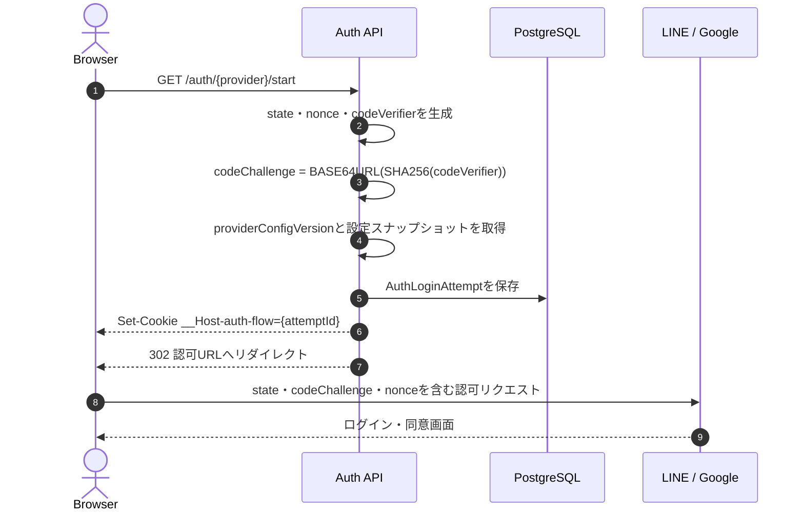
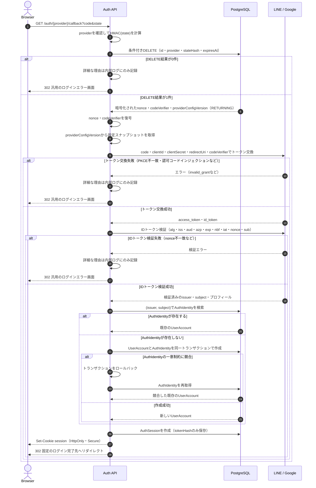

# Auth

LINE Login などの外部認証プロバイダーを利用した認証処理を管理する。

このディレクトリでは、プロバイダー固有のOAuth/OIDC通信と、アプリケーション側のユーザー・セッション管理を分離する。

## 前提

- ブラウザからバックエンドへリダイレクトするWebログインを想定する
- Cognitoなどの認証基盤は利用せず、ログイン後のアプリケーションセッションは自前で発行する
- LINE以外にGoogleなどのプロバイダーを追加できる構成にする
- LINEやGoogleのアクセストークン、IDトークンは、ログイン処理に必要な時間だけ扱い、原則として永続化しない

## 設計方針

`LINE` は認証全体の名前ではなく、外部プロバイダーとの接続部分でのみ使用する。

```text
auth/
├── controller/http/
│   ├── auth.route.ts
│   ├── line-login.route.ts
│   └── google-login.route.ts
├── usecase/
│   ├── start-login.use-case.ts
│   ├── complete-login.use-case.ts
│   └── revoke-session.use-case.ts
├── port/
│   ├── external-auth-provider.interface.ts
│   ├── auth-identity-repository.interface.ts
│   ├── auth-login-attempt-repository.interface.ts
│   ├── auth-session-repository.interface.ts
│   └── user-account-provisioner.interface.ts
├── infra/
│   ├── provider/
│   │   ├── line-auth-provider.ts
│   │   └── google-auth-provider.ts
│   ├── repository/
│   │   ├── user-account.repository.prisma.ts
│   │   ├── auth-identity.repository.prisma.ts
│   │   ├── auth-login-attempt.repository.prisma.ts
│   │   └── auth-session.repository.prisma.ts
│   └── crypto/
│       └── secret-box.ts
├── integration-test/
└── README.md
```

依存方向は次のようにする。

```text
controller → usecase → port ← infra
```

`usecase` はLINE SDK、Google SDK、Prismaなどを直接参照しない。`port` は外部との境界となるインターフェースであり、`infra` が実装する。

## ログインフロー

### 1. ログイン開始

`GET /auth/:provider/start` で次の値を生成する。

- `state`: CSRF対策とログイン試行の紐付けに使用するランダム値
- `nonce`: IDトークンのリプレイ・取り違え対策に使用するランダム値
- `code_verifier`: PKCEで使用する秘密値
- `code_challenge`: `code_verifier` から `S256` で生成する値
- `providerConfigVersion`: ログイン試行で使用するプロバイダー設定の不変なバージョン識別子

`state`、`nonce`、`code_verifier`、`providerConfigVersion` は同じログイン試行に属する値として保存する。認可URLには、少なくとも次を含める。

```text
response_type=code
client_id=...
redirect_uri=登録済みの固定URL
state=...
code_challenge=...
code_challenge_method=S256
scope=profile openid
nonce=...
```

ログイン試行の `id` は暗号学的乱数で生成し、`__Host-auth-flow` Cookieに保存する。このCookieを使って、コールバックを開始したブラウザのログイン試行を特定する。連番IDや推測可能な値は使用しない。

ログイン試行Cookieの属性は次で固定する。

```text
Set-Cookie: __Host-auth-flow=<attemptId>; Path=/; Max-Age=600; Secure; HttpOnly; SameSite=Lax
```

`__Host-` Cookieには `Domain` を指定しない。コールバックの成功・失敗などログイン試行が終了した場合は、同じ `Path=/` と `Secure` を指定し、`Max-Age=0` としてCookieを削除する。`SameSite=Strict` は外部プロバイダーからのトップレベルGETコールバックでCookieが送信されないため使用しない。

`providerConfigVersion` はサーバー側で許可されたプロバイダー設定を識別する。設定には、認可エンドポイント、トークンエンドポイント、Issuer、Client ID、Client Secretのバージョン、`redirect_uri`、スコープ、JWKS取得元または検証方式、許可する署名アルゴリズムを含める。

`redirect_uri` はログイン開始時に選択した設定スナップショットから決定する。クライアントから受け取った値は使用せず、コールバックとトークン交換でも同じ設定スナップショットを使用する。`client_secret` はDB、Cookie、URL、ログへ保存せず、サーバー側から秘密情報管理サービスを通じて取得する。ログイン試行の有効期限中は、使用した設定バージョンとClient Secretのバージョンを参照できるようにする。

ログイン試行の有効期限は短く設定する。初期値は5〜10分程度とし、期限切れの試行は完了できないようにする。



### 2. コールバック

`GET /auth/:provider/callback` では、次の順序で処理する。

1. `provider` がサーバー側で許可されたプロバイダーであることを確認する
2. `__Host-auth-flow` Cookieからログイン試行を取得する
3. `state`、プロバイダー、有効期限を検証する
4. 条件付きDELETEでログイン試行を原子的に消費し、nonce、codeVerifier、`providerConfigVersion` を取得する
5. 取得した設定スナップショットのClient ID、Client Secret、トークンエンドポイント、同じ `redirect_uri` と、取得した `code_verifier` でトークン交換する
6. IDトークンの署名とクレームを検証する
7. 検証済みの `issuer` と `subject` で `AuthIdentity` を検索する
8. 未登録ならユーザーと `AuthIdentity` を同一トランザクションで作成し、外部IDの一意制約競合時は既存のユーザーを再取得する
9. アプリケーション独自のセッションを発行する
10. サーバー設定で決めたログイン完了先へリダイレクトする

認可コード、IDトークン、アクセストークンをログに出力しない。コールバックをリロードされても、同じログイン試行を2回完了できないようにする。



認可コード交換やIDトークン検証に失敗しても、ユーザーには詳細な理由を返さず、汎用のログインエラー画面へ遷移させる。詳細な失敗理由はサーバー側のログやメトリクスで確認する。ログイン試行はトークン交換前に削除済みのため、失敗後は同じ試行を再利用せず、新しいログインを開始する。

## テーブル設計

### AuthLoginAttempt

OAuth/OIDCのログイン試行を一時的に保存するテーブル。CSRF対策とPKCEのための状態を、認証処理の完了まで保持する。

```text
AuthLoginAttempt
----------------
id              String    PK
provider        String    LINE / GOOGLEなど
providerConfigVersion String  開始時に使用したプロバイダー設定のバージョン
stateHash       String    HMAC化したstate。検索用インデックスは付けない
nonce           String    DBではAEAD暗号文として保存
codeVerifier    String    DBではAEAD暗号文として保存
expiresAt       DateTime
createdAt       DateTime
```

設計上の注意点:

- `id` は暗号学的乱数で生成し、`__Host-auth-flow` Cookieの値として使用する。Cookieには `Path=/`、`HttpOnly`、`Secure`、`SameSite=Lax`、短い `Max-Age` を付け、`Domain` は指定しない
- `state` は平文で保存せず、サーバー秘密鍵を使ったHMACなどのハッシュを保存する
- `code_verifier` はコールバック時に復元する必要があるため、ハッシュではなくAEADで暗号化して保存する
- `nonce` はプロバイダーのIDトークン検証に必要になるため、平文ではなく暗号化保存する
- `client_secret` はAuthLoginAttempt、Cookie、URL、ログへ保存せず、設定スナップショットのバージョンからサーバー側で取得する
- 暗号鍵はDBに保存せず、環境変数または秘密情報管理サービスから取得する
- `providerConfigVersion` から、開始時と同じIssuer、Client ID、Client Secret、エンドポイント、`redirect_uri`、JWKS設定、署名アルゴリズムを復元できるようにする
- 設定やClient Secretをローテーションする場合も、ログイン試行の有効期限中は旧バージョンを参照できるようにする
- コールバック時は`attemptId`を主キーに検索するため、`stateHash`にはユニーク制約や検索用インデックスを付けない
- `id`、`provider`、`stateHash`、`expiresAt > 現在時刻` を条件に、`DELETE ... RETURNING` を実行する
- DELETEの結果が1件の場合だけ、取得した`nonce`、`codeVerifier`、`providerConfigVersion`で後続処理を行う。0件の場合は認証を拒否する
- DELETEは条件確認と同時に行うため、同じログイン試行の並行コールバックを1回だけ通過させられる
- `expiresAt` はコールバック時の有効期限判定と、コールバックされなかったレコードの定期削除に使う
- 初期設計では`expiresAt`にインデックスを付けない。レコード数が増え、期限切れレコードの削除が負荷になった時点で追加する
- `redirectUri` 自体ではなく、開始時に使用した設定スナップショットを識別する `providerConfigVersion` を保存する
- ログイン後の遷移先を指定する要件がないため、`returnTo` は持たせない。将来追加する場合は、許可済みの相対パスだけを保存する

ログイン試行をコールバックの最後に削除するのではなく、トークン交換より前に原子的に削除する。トークン交換やIDトークン検証に失敗した場合は、同じログイン試行を再利用せず、新しいログイン試行を開始する。これにより、`status` や `consumedAt` を持たずに一度きりの処理を保証できる。

概念的なSQLは次のとおり。

```sql
DELETE FROM AuthLoginAttempt
WHERE id = :attemptId
  AND provider = :provider
  AND stateHash = :stateHash
  AND expiresAt > CURRENT_TIMESTAMP
RETURNING nonce, codeVerifier, providerConfigVersion;
```

DBではなく、共有セッションストアに一時情報を保存する実装も可能だが、現在の構成ではPostgreSQL上のこのテーブルを第一候補とする。

### UserAccount

アプリケーション内でユーザーを表すアカウントテーブル。認証を起点に新しく作成する。

```text
UserAccount
-----------
id           String    PK
displayName  String    NULL可。プロフィール未設定を許容する
email        String    NULL可。ログイン識別子には使わない
createdAt    DateTime
updatedAt    DateTime
```

パスワードログインを提供しない前提では、`password` カラムは持たせない。メールアドレスはプロフィール情報として保持する場合だけ追加し、外部IDの代わりには使わない。

関連は次のようにする。

```text
UserAccount 1 ─── * AuthIdentity
UserAccount 1 ─── * AuthSession
UserAccount 1 ─── * Todo（Todoを残す場合）
```

### AuthIdentity

外部認証プロバイダーのユーザーと、アプリケーションの `UserAccount` を紐付けるテーブル。

```text
AuthIdentity
------------
id          String    PK
userId      String    FK -> UserAccount.id
provider    String    LINE / GOOGLEなど
issuer      String    OIDCのiss
subject     String    OIDCのsub
createdAt   DateTime
updatedAt   DateTime
```

制約:

```text
UNIQUE (issuer, subject)
UNIQUE (userId, provider)
```

ログイン時のユーザー識別には、メールアドレスや表示名ではなく `(issuer, subject)` を使用する。LINEのユーザーIDやGoogleの `sub` を、`line_user_id` のように `UserAccount` へ直接追加しない。

メールアドレスはプロバイダーによって取得できない場合や変更される場合があるため、メールアドレスだけで既存ユーザーへ自動紐付けしない。既存アカウントとの統合を行う場合は、ログイン済みユーザーによる明示的なアカウント連携フローを用意する。

## 初回ログイン時の競合処理

初回ログイン時は、`UserAccount` と `AuthIdentity` を同一DBトランザクションで作成する。既に同じ `(issuer, subject)` が存在する場合は、重複登録せず既存の `UserAccount` にログインさせる。

ここでいう競合は、同じ `AuthLoginAttempt` のコールバックが再送されることではなく、同じ外部IDに対する別々のログイン試行が同時に初回ログインを完了することで発生する。例えば、次のような場合がある。

- まだアカウントを作成していないユーザーが、PCとスマートフォンで同時にログインする
- 別のブラウザプロファイルやプライベートウィンドウで、同じプロバイダーのログインを同時に完了する
- 複数のバックエンドインスタンスが、別々のログイン試行のコールバックを同時に処理する

この場合、各コールバックは異なる `AuthLoginAttempt` を持つため、どちらも次のように「AuthIdentityが存在しない」と判断する可能性がある。

```text
コールバックA: AuthIdentityを検索 → 存在しない
コールバックB: AuthIdentityを検索 → 存在しない

コールバックA: UserAccount + AuthIdentityを作成 → 成功
コールバックB: UserAccount + AuthIdentityを作成 → UNIQUE (issuer, subject) 違反
```

同じ `AuthLoginAttempt` の再利用は、コールバック前の条件付きDELETEによって1回だけ通過させる。この仕組みだけでは別々のログイン試行による初回登録競合は防げないため、`UNIQUE (issuer, subject)` の制約違反をアプリケーションで競合として処理する。

競合した場合は、次の処理を行う。

1. `UNIQUE (issuer, subject)` の制約違反だけを競合として判定する
2. 競合側のトランザクションをロールバックし、途中まで作成した `UserAccount` を残さない
3. `AuthIdentity` を再取得し、作成に成功した既存の `UserAccount` を取得する
4. 取得した `UserAccount` に対して通常どおりセッションを発行する

メールアドレスの制約違反など、外部IDの一意制約以外のエラーは競合として扱わず、認証処理の失敗として処理する。

### AuthSession

ログイン完了後にアプリケーションが発行するセッションを管理するテーブル。

```text
AuthSession
-----------
id          String    PK
userId      String    FK -> UserAccount.id
tokenHash   String    UNIQUE
expiresAt   DateTime
revokedAt   DateTime  NULL可
lastUsedAt  DateTime  NULL可
createdAt   DateTime
```

ブラウザには推測困難なランダムセッショントークンを次のCookieで渡し、DBにはトークンそのものではなくハッシュだけを保存する。

```text
Set-Cookie: __Host-session=<sessionToken>; Path=/; Max-Age=<sessionLifetimeSeconds>; Secure; HttpOnly; SameSite=Lax
```

`Domain` は指定しない。Cookieの有効期間は `AuthSession.expiresAt` と一致させる。

```text
ブラウザCookieのセッショントークン
              ↓ ハッシュ化
AuthSession.tokenHash
```

LINEのアクセストークンやIDトークンをアプリケーションのセッションとして利用しない。LINE APIをログイン後にも呼び出す必要がある場合だけ、プロバイダー用トークンを別テーブルに暗号化保存する。

## 3つの値の役割

| 値              | 主な脅威                           | 保存方法     | 検証方法                           |
| --------------- | ---------------------------------- | ------------ | ---------------------------------- |
| `state`         | コールバックへのCSRF               | HMACハッシュ | コールバックの値をHMACして一致比較 |
| `code_verifier` | 認可コードインジェクション・横取り | AEAD暗号化   | トークン交換時に元の値を送信       |
| `nonce`         | IDトークンのリプレイ・取り違え     | AEAD暗号化   | IDトークンの `nonce` と一致比較    |

3つともログイン試行ごとに新しく生成し、使い回さない。`state` は認可URLとコールバックURLに、`code_challenge` と `nonce` は認可URLにプロトコル上現れるが、アクセスログやアプリ内の追加リダイレクト先へ出力しない。`code_verifier` と `client_secret` はURLへ出力しない。

## IDトークン検証

JWTをデコードしただけでユーザー情報を信頼しない。プロバイダーごとのアダプターで、少なくとも次を検証する。

- 署名が正しいこと
- 設定スナップショットに定義された許可アルゴリズムだけを受け入れ、`alg=none` を拒否すること
- 設定スナップショットから取得した信頼済みJWKSの `kid` 対応鍵で署名検証すること。未知の `kid` には鍵更新を考慮し、任意のURLから鍵を取得しないこと
- `iss` が設定スナップショットに定義されたIssuerと完全一致すること
- `aud` が設定スナップショットのClient IDを含むこと。`aud` が複数値の場合は `azp` がClient IDと一致すること
- `exp` が期限内であること
- `nbf` が存在する場合は有効時刻を満たし、`iat` が未来になっていないこと。時計ずれの許容値を固定すること
- `max_age` を要求した場合は `auth_time` を必須として再認証時刻を検証すること
- `nonce` がログイン試行の値と一致すること
- `sub` が存在し、空でなく、OIDC仕様上の長さ制限内であること

LINE Loginでは、LINEが提供するIDトークン検証エンドポイントを利用する場合も、設定スナップショットのClient IDとログイン試行の `nonce` を検証要求に使用する。署名検証を行う場合は、設定スナップショットで許可したIssuer、JWKS、アルゴリズムだけを使用する。クライアントから送られた表示名・メールアドレスをそのままユーザー登録情報として信頼せず、検証済みのIssuer・Subjectと、LINEの検証結果またはLINE APIから取得した情報を使う。

## `domain` ディレクトリについて

`domain` は必須ではない。OAuthの認可コード交換、HTTP通信、暗号化、Cookie処理は認証の技術的な実装であり、`infra` または `controller` の責務である。

一方、次のようなアプリケーション固有のルールが増えた場合は、`auth/domain` を追加する。

- 1つの外部IDは必ず1つのユーザーにだけ紐付く
- 1ユーザーに同じプロバイダーを2つ紐付けられない
- 外部アカウントの連携・解除に条件がある
- アカウント統合や退会時の認証情報削除にルールがある

その場合の候補は次のとおり。

```text
auth/domain/
└── auth-identity/
    ├── auth-identity.entity.ts
    └── auth-identity-policy.ts
```

現時点では、`AuthIdentity` の一意性をDB制約とユースケースで担保し、ドメイン層は必要になった時点で追加する方針とする。

## 実装時のチェックリスト

- [ ] ログイン試行ごとに `state`、`nonce`、`code_verifier` を生成する
- [ ] PKCEは `S256` を使用し、`code_verifier` をブラウザからコールバックパラメーターで受け取らない
- [ ] `__Host-auth-flow` Cookieに `Path=/`、`Secure`、`HttpOnly`、`SameSite=Lax`、短い `Max-Age` を付け、`Domain` を指定しない
- [ ] `state` をトークン交換より前に検証する
- [ ] `providerConfigVersion` で開始時と同じプロバイダー設定スナップショットを使用する
- [ ] サーバー側の `client_secret` をトークン交換に使用し、DB、Cookie、URL、ログへ出力しない
- [ ] `redirect_uri` を設定スナップショットから取得し、認可開始時とトークン交換時で完全一致させる
- [ ] ログイン試行を一度だけ消費できるようにする
- [ ] IDトークンの許可アルゴリズム・JWKS・`iss`・`aud`・`azp`・`exp`・`nbf`・`iat`・`nonce`・`sub` を検証する
- [ ] ユーザー識別に `(issuer, subject)` を使用する
- [ ] 同じ外部IDの初回ログインが並行した場合、外部IDの一意制約競合を再取得に変換する
- [ ] 外部トークン、認可コード、`state`、`nonce`、`code_verifier` をログに出力しない
- [ ] セッションCookieに `Path=/`、`HttpOnly`、`Secure`、`SameSite=Lax` を付け、`Domain` を指定しない
- [ ] 期限切れの `AuthLoginAttempt` を削除する
- [ ] 認証失敗時に、外部から入力された詳細なエラーをそのまま画面へ返さない

## 参考資料

- [LINE Login v2.1 API reference](https://developers.line.biz/en/reference/line-login/)
- [Integrating LINE Login with your web app](https://developers.line.biz/en/docs/line-login/integrate-line-login/)
- [LINE Login security checklist](https://developers.line.biz/en/docs/line-login/security-checklist/)
- [RFC 7636: Proof Key for Code Exchange by OAuth Public Clients](https://www.rfc-editor.org/rfc/rfc7636)
- [OpenID Connect Core 1.0](https://openid.net/specs/openid-connect-core-1_0-final.html)
